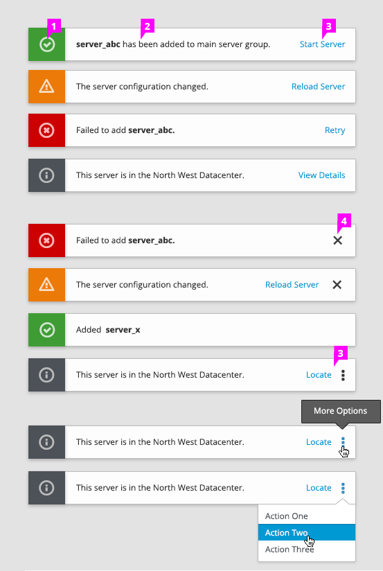

# Toast Notifications

It is recommended that Toast Notifications are transient and stay on the screen for eight seconds so that the user has time to read the message without it blocking information on the page for an extended amount of time. All Toast Notifications should remain on the screen when the user is hovering over one of them. Ideally, the user can decide what kinds of notifications appear and how long they remain on the screen. The notifications should have a consistent location in each application. We recommend the top-right of the application, underneath the [Masthead](http://www.patternfly.org/pattern-library/application-framework/masthead/).

1. **Icon:** Indicates the type of notification displayed (e.g. info, success, warning or error).

1. **Message:** The message should explain what just happened and what the user needs to perform next. Do not include any unnecessary text. Ideally, the message is no longer than one line. Bold the important information (e.g. the names of relevant objects).

1. **Action** (optional): Show actions on the right for easy access. It is recommended that only one action is shown in each notification. However, the ellipsis icon can be used when more than one actions are available. Clicking on an action should either help the user achieve the goal automatically, or open up a modal window or a different page. After the user clicks on the action, the notification will be dismissed right away.

1. **Close** (optional): The user can dismiss the toast notification by clicking on the close icon.
