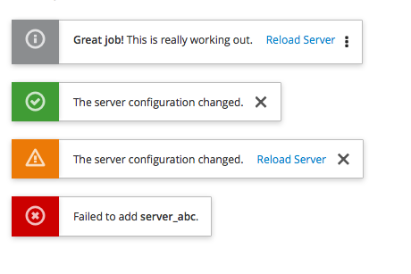
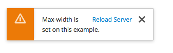

# Toast Notifications

Toast notifications pop onto the screen to notify the user of a system occurrence. The notifications should have a consistent location in each application. We recommend the top-right of the application. It should include a message list that enables the user to view messages later.

Toast notifications should be transient and stay on the screen for 8 seconds, so that they do not block the information behind them for too long, but allows the user to read the message. Ideally, the user can decide what kinds of notifications appear and how long they remain on the screen. Toast notifications should remain on the screen when the user is hovering on them.

Jump to [Examples](https://www.patternfly.org/pattern-library/communication/toast-notifications/#/example-overview-1), [With Max-Width](https://www.patternfly.org/pattern-library/communication/toast-notifications/#/example-overview-2) or [In Context](https://www.patternfly.org/pattern-library/communication/toast-notifications/#/example-overview-3)

## Examples

## With Max-Width

## In Context

