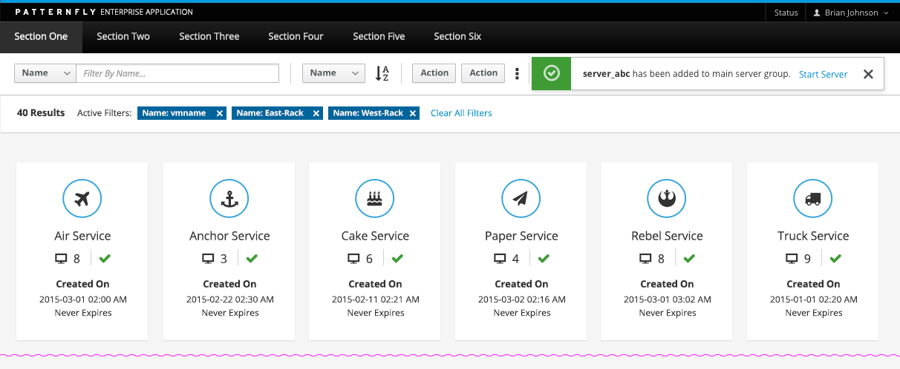

# Toast Notifications

Toast Notifications notify the user of a system occurrence. The notifications should have a consistent location in each application. We recommend the top-right of the application. The [Notification Drawer](http://www.patternfly.org/pattern-library/communication/notification-drawer/) can be used in conjunction with Toast Notifications to allow the user to view messages later.

## In Context

