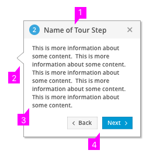
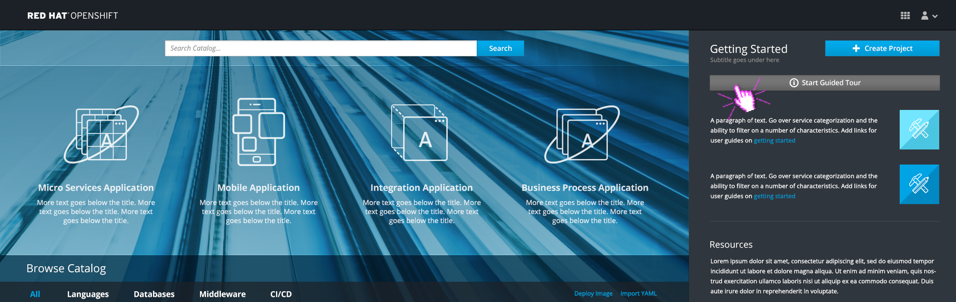
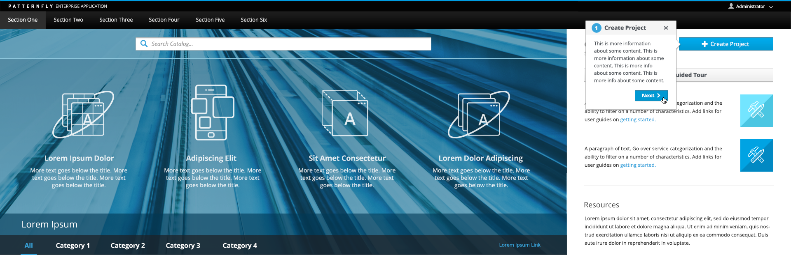
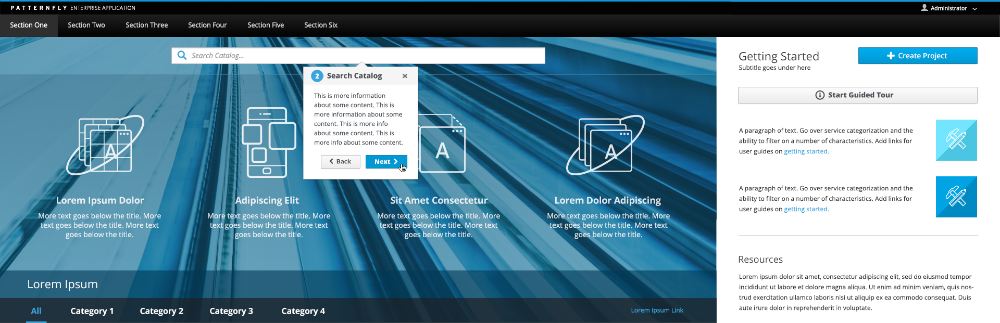
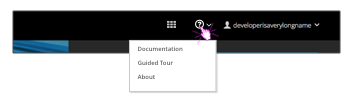

# Tour
- When a tour is available, a button or link should be displayed for users to manually start it. Labels should be specific if there are multiple tours available.
- Tours can include any number of steps, but the recommendation is to stay between 3-15 steps.
- Every step displays a bubble with the step number, name, and description of what is being highlighted.

1. **Top Bar:** A light grey bar sits across the top of the tour bubble and includes the following items vertically aligned:  
  - A **Step Number** to denote where the user currently is along the tour.
  - A **Step Name** to highlight the topic of the particular step.
  - A **Cancel** or close button, allowing the user to end the tour at any point.
2. **Pointer:** The pointer is used to identify a specific area in the UI.
3. **Description:** The description should include key details pertaining to the highlighted area.
4. **Actions:**
  - Users should always be able to go back to previous steps using the back button and move onto next steps using the next button. The first step will not have a back button.
  - At the end of the tour, the Next button should turn into a "Done" button to signify the tour has ended.

## Tour Example

Provide a way for new users to start a tour of the UI:
  

Click Next to move on to the next step in the tour:
  

Click Back or Next to continue through the tour:
  

## Additional Considerations
- In some cases, a tour may be customizable by admin users, allowing access to overwrite step names and descriptions.
- Tours can be automatically triggered for new users to step through the UI on their initial login. Automatic tours are recommended for first time use only.
- Step numbers are dynamic. In some cases, users may not have access to view all steps or all areas of the UI, so the numbers should update accordingly for each tour instance.

Add guided tours to the Help menu in the masthead when available:

