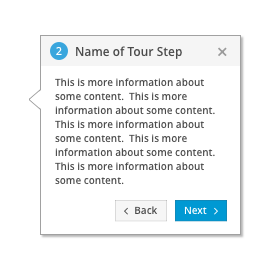

# Tour
Tours are helpful tools provided to users as an introduction to new interfaces or new use cases they may not be familiar with. A tour will take users step by step, pointing out specific areas of the interface. Each step of a tour will include the step number, name, and description of what is being highlighted.

## Example
The following is an example of a single step within a guided tour:

