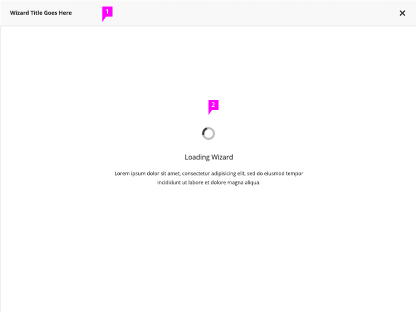
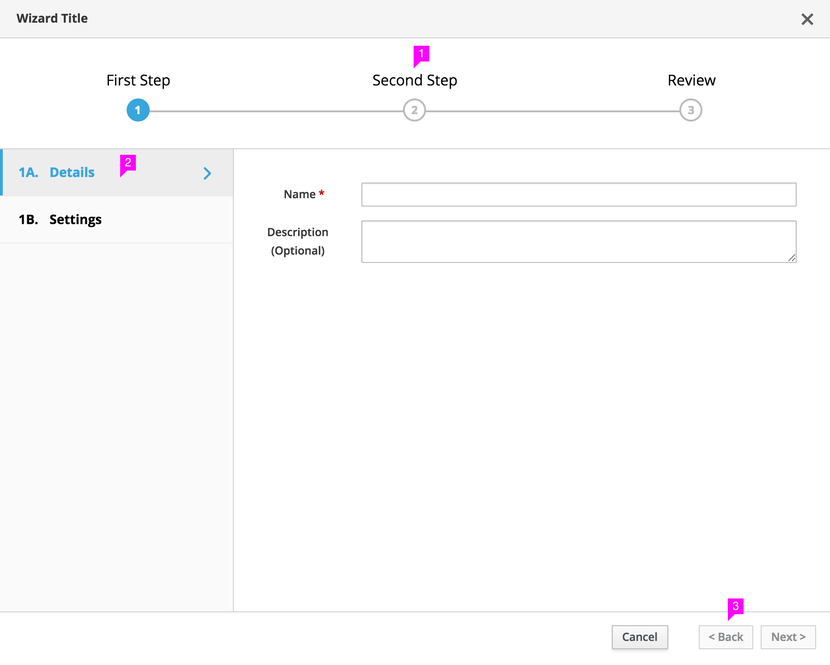
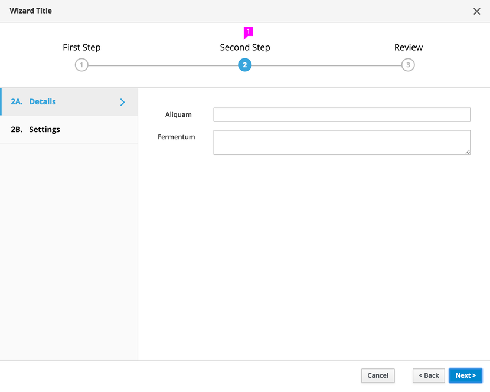
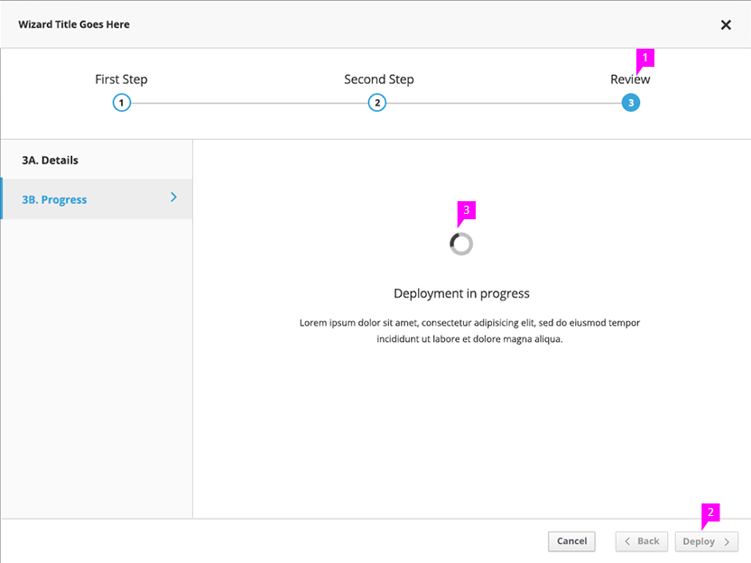
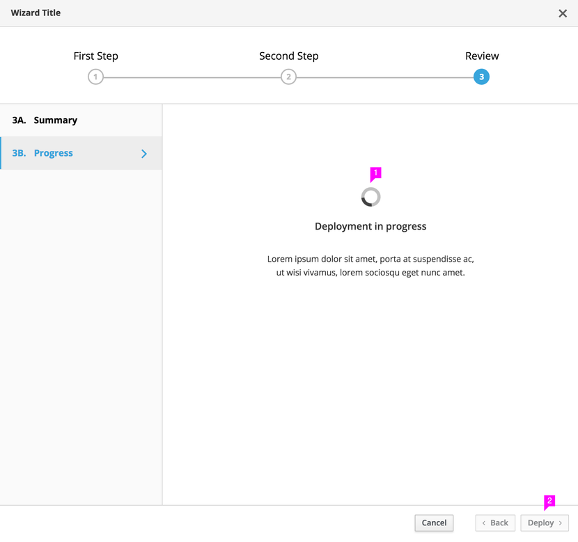

# Wizard

## Loading Screen

1. **Title Bar** (optional for embedded wizards)**:** There should be a title bar for the wizard, this is required for modal wizards and optional for embedded wizards. The title given to the wizard should convey the purpose of the wizard and the process the user is going through. It can be the action label on the button, link or menu that invokes the wizard, but should also take advantage of the ability for something more descriptive while remaining concise.
1. **Loading Wizard State** (optional)**:** For cases when wizard will take a few moments to load, we recommend using a loading indicator and short message informing the user that the wizard is loading. Wizard will be empty besides the message and indicator.

## First Step

1. **Main Steps:** The main steps of the wizard are shown in the bar along the top of the screen. User can always see all of the primary steps in the flow at all times. The main step labels can be used to jump between steps in a non-sequential manner as long as previous steps have been completed. This should also be enabled for next steps as long as all required information has been completed on the current step and there are no dependencies between the steps. Main steps can be broken down into sub-steps.
1. **Sub-steps for the Selected Main Step:** Sub-steps are optional. If they are used, every effort should be made to provide sub-steps for each step in order to maintain a consistent layout and expectation from the users.
1. **Button Bar:** The button bar provides the appropriate action buttons, these are usually a combination of Cancel, Back, Next and Finish. The exact wording on the Finish button can be adjusted to be more reflective of the completion action appropriate to what the user will be doing. The Back button should always be enabled except for the first step. The Next button should become enabled once all required information has been entered for the current step and/or sub-step. The Next button will move the user through any sub-steps before it moves the user to the next main step. The Back button will also behave the same way. In some cases the completion action button will close the dialog, in others, it views progress in the wizard, and ends up changing the label of that button.
In the example above, the back button is disabled since this shows the first sub step within the first step.

## Next Step

1. **Main Steps:** The step that the user is currently on should be highlighted in some way to appear different than the other steps. If other steps are enabled, the user can click to go to that step either previous or next depending on the completion of or need for required inputs.
1. **Expand/Collapse Information** (optional): Progressive disclosure can be used in the main content area of the step in order to accommodate more information. This is recommended to be used only as necessary or on the review step.

## Final Step – Progress

1. **Main Steps:** The last step in the wizard can be a Review step that shows a summary of the information selected and/or set in the previous steps of the wizard. A Review step is optional but can provide a place to show a summary of the settings the user has gone through. Exact wording of the step and sub-steps can change depending on what makes sense for the particular task. Review along with Summary and Progress are only suggestions.
1. **Completion Button:** Once all required information has been provided, the Next button becomes the Completion button with wording that makes sense for the particular task. For wizards that do not remain open while the particular task is being processed, the Completion button would close the wizard. On the last step of the wizard, there is no Next button.
1. **Progress Indicator:** If it takes a few moments to load the information into the page, a progress indicator can be used. In most instances when this occurs, the Back and Completion buttons should be disabled. The Cancel button can be enabled if cancelling the process is supported by the wizard.

## Completion Page

1. **Completion Message:** If the completion button does not close the wizard, a completion message can be used to provide users with feedback that the wizard has been successfully completed or if any errors have occurred.
1. **Completion Button:** The wording on the completion button can change once processing of the content in the wizard is complete. This may be Close or some other word that makes sense for the particular use case. If the user has the option to go back and make alterations and resubmit the process, then the Back button should be enabled.

### What’s not covered in the current design but will be covered in future sprints:

The following functionality is not covered in this pattern:

1. In certain cases, the wizard will need to show step by step progress. This functionality is not covered.
1. In some cases, it may be advantageous to the user to be able to jump to the review page without having completed previous steps.
1. For more complex and time-consuming tasks, a wizard can have an optional save to let the user leave the wizard and return later. Some considerations for this feature are auto-saving and what happens if a session times out.
1. For more complex wizards, there may be more steps or text than can be shown on the screen at one time. This pattern does not address the scalability of the main step bar.
1. Wizards can be shown in modal dialogs or embedded on the main page. This pattern only address modal dialog implementations. Embedded wizards may need different design considerations such as location of buttons on the button bar and how Back and Next might work.

These requirements will be added to the pattern at a later date.
