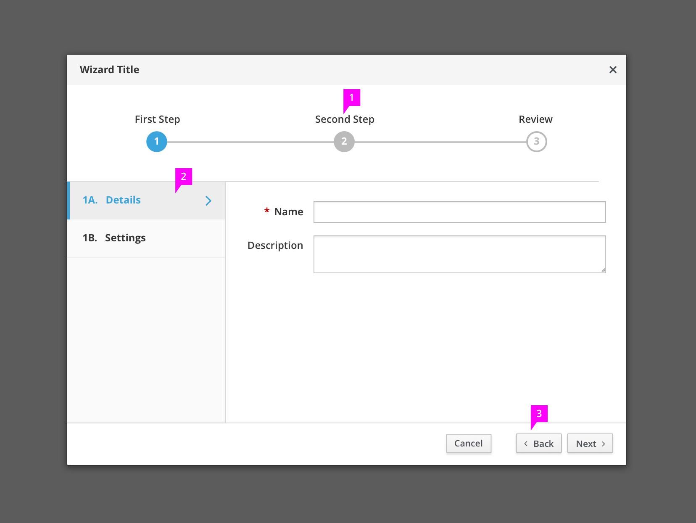
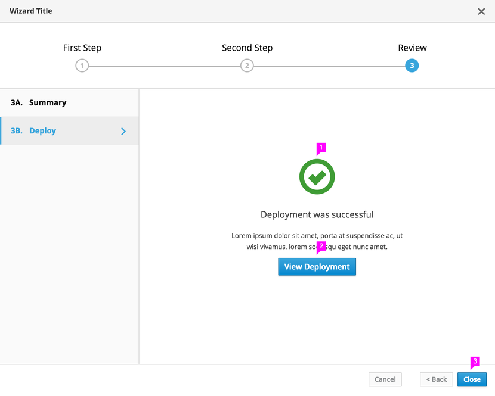
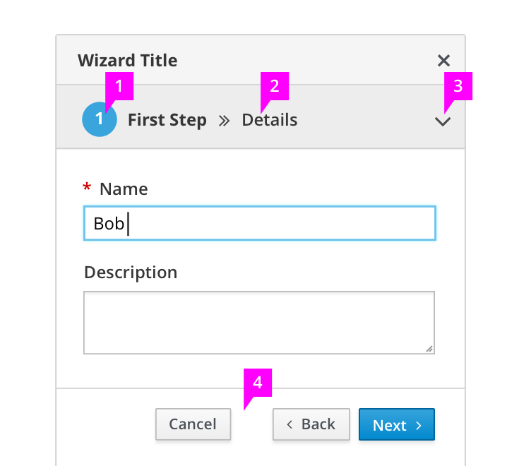
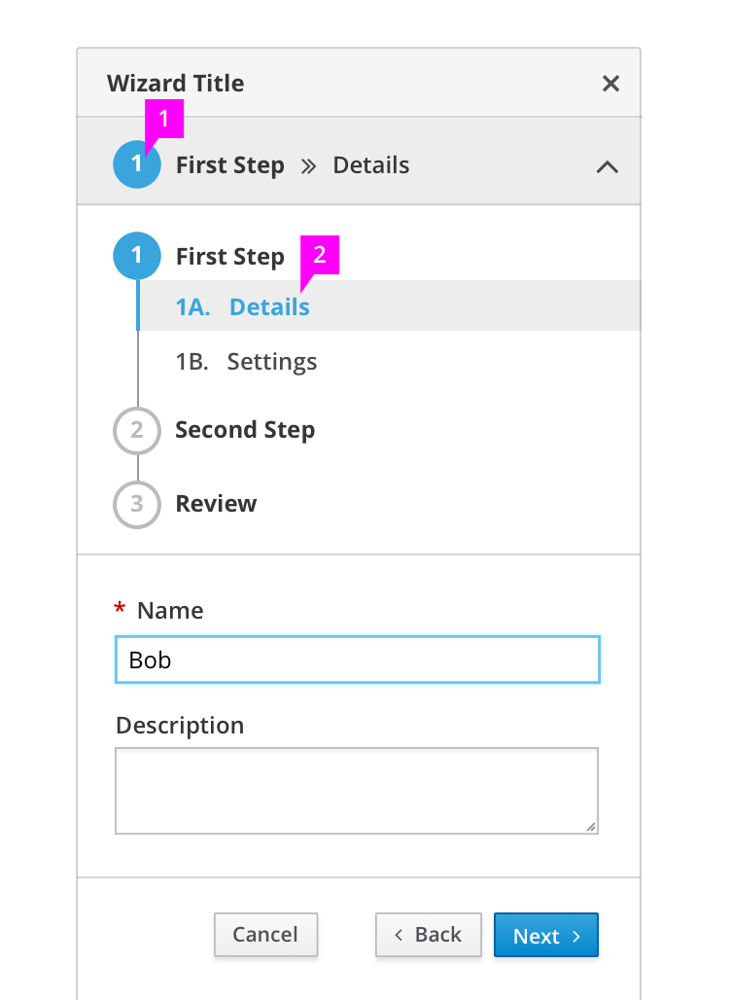
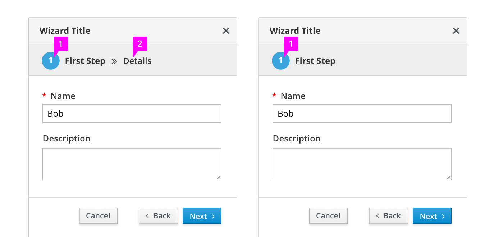

# Wizard

## Loading Screen

1. **Title Bar:** The title given to the wizard should convey the purpose of the wizard and the process the user is going through. It can be the action label on the button, link, or menu that invokes the wizard, but should also take advantage of the ability for something more descriptive while remaining concise.
1. **Loading Wizard State** (optional): For cases when the wizard will take a few moments to load, we recommend using a loading indicator and short message informing the user that the wizard is loading. Otherwise, the wizard should be empty.

## First Step

1. **Main Steps:** The main steps of the wizard are shown in the bar along the top of the screen. The user can always see all of the primary steps in the flow at all times. The main step labels can be used to jump between steps in a non-sequential manner as long as previous steps have been completed. This should also be enabled for next steps as long as all required information has been completed on the current step and there are no dependencies between the steps. Main steps can be broken down into sub-steps.
1. **Sub-Steps for the Selected Main Step:** Sub-steps are optional. If they are used, every effort should be made to provide sub-steps for each step in order to maintain a consistent layout and expectation from the users. The sub-step labels can be used to jump between sub-steps in a non-sequential manner as long as previous sub-steps have been completed. This should also be enabled for next sub-steps as long as all required information has been completed on the current sub-step and there are no dependencies between the sub-steps.
1. **Button Bar:** The button bar provides the appropriate action buttons. These are usually a combination of Cancel, Back, Next, and Finish. The Back button should always be enabled except for the first step. The Next button should become enabled once all required information has been entered for the current step and/or sub-step. The Next button will move the user through any sub-steps before it moves the user to the next main step. The Back button will also behave the same way. In the example above, the back button is disabled since this shows the first sub-step within the first step. The Cancel button will close the wizard dialog.

**Usage Note:** Main step and sub-step names should be kept as short and descriptive as possible. Preferably only one or two words.

## Next Step

1. **Main Steps:** The step that the user is currently on should be highlighted in some way to appear different than the other steps. If other steps are enabled, the user can click to go to that step either previous or next depending on the completion of or need for required inputs.

## Final Step - Summary (optional)

1. **Main Steps:** The last step in the wizard can be a Review step that shows a summary of the information selected and/or set in the previous steps of the wizard. A Review step is optional but can provide a place to show a summary of the settings the user has gone through. Exact wording of the step and sub-steps can change depending on what makes sense for the particular task. Review along with Summary and Progress are only suggestions.
1. **Expand/Collapse Information** (optional): Progressive disclosure can be used in the main content area of the summary step in order to accommodate more information. While this can be used anywhere in the wizard, it is recommended to be used only as necessary or on the summary review step.
1. **Completion Button:** Once all required information has been provided, the Next button becomes the completion button with wording that makes sense for the particular task (i.e., Finish, Close, or Deploy). In some cases the Completion button will close the wizard dialog. In others the button becomes disabled and the text changes to indicate that the wizard is processing or finishing.

## Final Step – Progress (optional)

1. **Progress Indicator:** If it takes a few moments to load the information into the page, a progress indicator can be used. In most instances when this occurs, the Back and completion buttons should be disabled. The Cancel button can be enabled if canceling the process is supported by the wizard.
1. **Completion Button:** While the final step is processing, the Completion button should be disabled, and the wording may change to indicate that the task is in progress.

## Completion Page (optional)

1. **Completion Message:** If the completion button does not close the wizard, a completion message can be used to provide users with feedback that the wizard has been successfully completed or if any errors have occurred.
1. **Action Button** (optional): An optional action button may be added to the completion page that takes the user to a page in the application where they can view the information submitted in the wizard.
1. **Completion Button:** The wording on the completion button can change once processing of the content in the wizard is complete. This may be Close or some other word that makes sense for the particular use case. If the user has the option to go back and make alterations and resubmit the process, then the Back button should be enabled.

## Responsive States

### Mobile Wizard

1. **Current Main Step:** The currently active main step is displayed at the top of the form along with the step number.
1. **Current Sub-step** (optional): If the current main step has sub-steps, the name of the sub-step appears next to it at the top of the page. If the main and sub-step names are long enough that [truncation](https://www.patternfly.org/styles/terminology-and-wording/#truncation) is required, the sub-step name should be truncated before the main step name unless the sub-step name is critical to filling in the form.
1. **Steps Dropdown:** Clicking on this dropdown reveals all steps in the wizard and enables users to switch between them if applicable.
1. **Button Bar:** Wizard actions are available on the button bar which is fixed at the bottom of the page except for in smaller screen sizes, which requires the user to scroll the page for the button bar.

### Mobile Wizard - Steps Dropdown

1. **Main Steps:** Main wizard steps are shown vertically when the steps dropdown is expanded. Clicking on a different step will display its sub-steps, or switch to it if it does not have any sub-steps.
1. **Sub-steps for the Selected Main Step** (optional): Clicking on a sub-step will switch to that sub-step. The current sub-step is highlighted.

### Simplified Mobile Wizard
If an application does not require the ability to switch between or view all steps from mobile devices, a simplified version of the wizard without a dropdown can be used instead.

1. **Current Main Step:** The currently active main step is displayed at the top of the form along with the step number.
1. **Current Sub-step** (optional): If the current main step has sub-steps, the name of the sub-step appears next to it at the top of the page.

### What’s not covered in the current design:
1. In certain cases, the wizard will need to show step by step progress. This functionality is not covered.
1. In some cases, it may be advantageous to the user to be able to jump to the review page without having completed previous steps.
1. For more complex and time-consuming tasks, a wizard can have an optional save to let the user leave the wizard and return later. Some considerations for this feature are auto-saving and what happens if a session times out.
1. For more complex wizards, there may be more steps or text than can be shown on the screen at one time. This pattern does not address the scalability of the main step bar.
