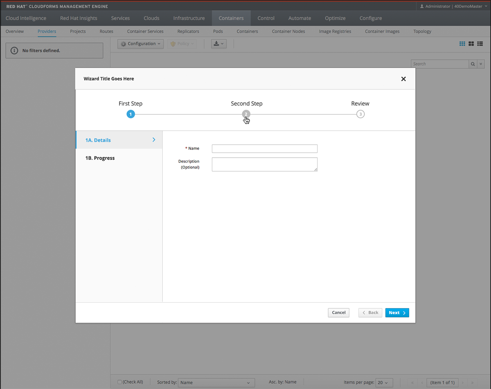
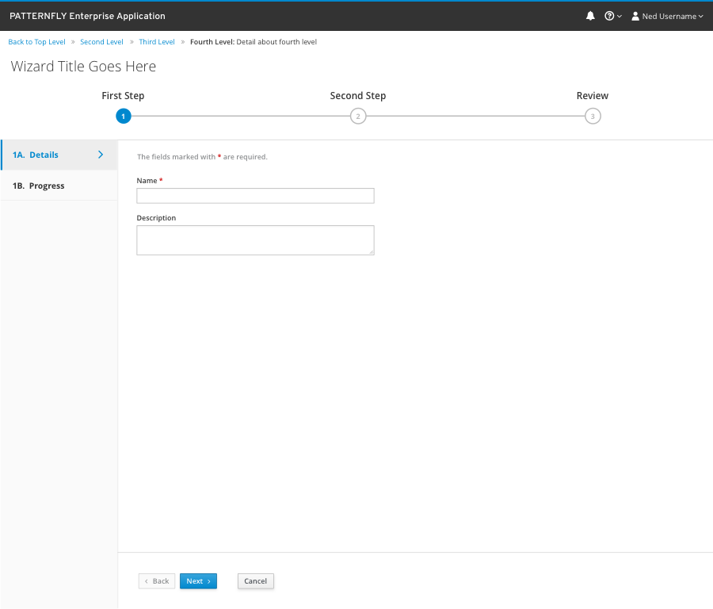

# Wizard

Wizards should be used when the user needs to go through a sequential set of steps to complete a task. A wizard is a good way to break a complex task into sub-tasks that can be more readily understood and completed. More complex wizards can have branching which takes the user to a different step depending on their settings/answers to previous questions. Wizards may appear as a modal, or be embedded in a page.

Modal Wizard

Embedded Wizard

