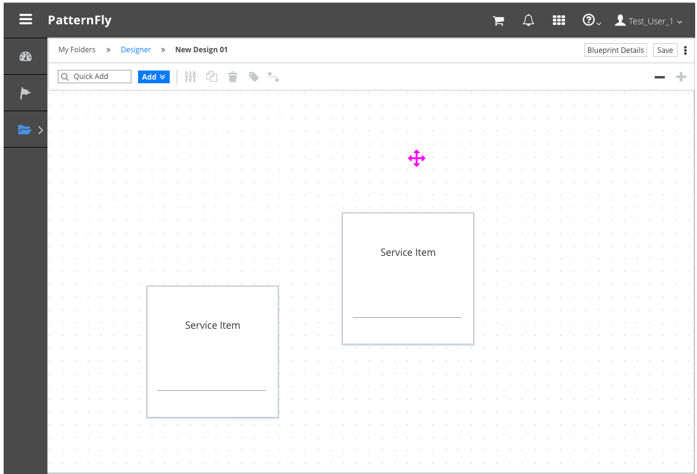

# Canvas View

  1. **Toolbox:** All items that can be dragged onto the canvas are available in the Toolbox. The toolbox can be Left-aligned or top-aligned depending on the use case.
  2. **Item-Level Actions:**  Item-level actions are left-aligned and apply to the individual items that are dragged onto the canvas, for example edit, copy, and remove item.
  3. **Canvas Items:** Canvas items are things that have been dragged from the toolbox onto the canvas. In some cases items can be ordered or connected to represent a particular flow of information.
  4. **Canvas:** A grid based background should cover the working area of the Canvas View. Objects can be placed on the canvas to create a workflow.
  5. **General Canvas Actions** (optional): All actions that are right aligned on the toolbar, such as the zooming actions, will apply to the canvas itself rather than specific canvas items.
  6. **Properties Panel** (optional): For cases where users can view or edit item properties, a panel should be presented on the right side of the canvas. It should be clear which item properties are being displayed and users should have the ability to collapse the properties panel.

## Example with Top-aligned Toolbox
A top-aligned toolbox is recommended for cases where toolbox items require additional classification or filtering.

## Zooming and Panning on the Canvas
Implementing the pan and zoom functionality is optional, but is recommended for any canvas view that has the potential for becoming overcrowded with canvas items.

### Zooming
* The fa-minus and fa-plus icons should be used as the action buttons for zooming in and out of the canvas.
* The default zoom level will be considered 100% zoom. The + button is disabled at this zoom level.
* Clicking the fa-minus button once will cause the canvas to transition to 75% of the original zoom level.
* Zooming out a second time will redraw the canvas at 50% of the original size. This will be the most zoomed-out state of the canvas.

### Panning
* Clicking and dragging on the canvas background when the cursor is in the all-scroll state will pan the canvas.
* When the canvas is not zoomed out all the way, hovering over the canvas background will change the mouse pointer to “cursor:all-scroll”.
* When it is zoomed out all the way, the cursor property will be set to “cursor: default”.

