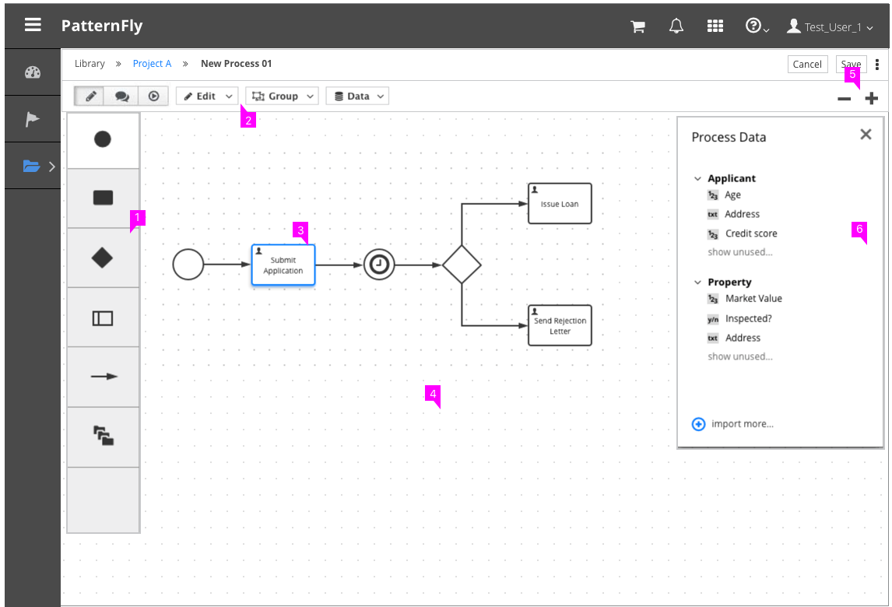
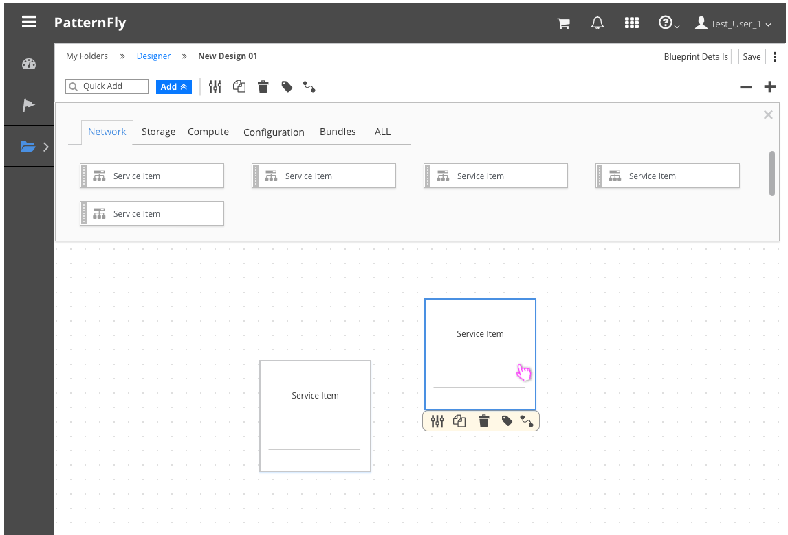

# Canvas View

  1. **Toolbox:** All items that can be dragged onto the canvas are available in the Toolbox. The toolbox can be Left-aligned or top-aligned depending on the use case.
  2. **Item-Level Actions:**  Item-level actions are left-aligned and apply to the individual items that are dragged onto the canvas, for example edit, copy, and remove item.
  3. **Canvas Items:** Canvas items are things that have been dragged from the toolbox onto the canvas. In some cases items can be ordered or connected to represent a particular flow of information.
  4. **General Canvas Actions** (optional): General canvas actions do not apply to specific canvas items, rather they act on the canvas itself, such as zooming in and out. These actions are right-aligned on the toolbar.
  5. **Properties Panel** (optional): For cases where users can view or edit item properties, a panel should be presented on the right side of the canvas. It should be clear which item properties are being displayed and users should have the ability to collapse the properties panel.

## Example with Top-aligned Toolbox
A top-aligned toolbox is recommended for cases where toolbox items require additional classification or filtering.

