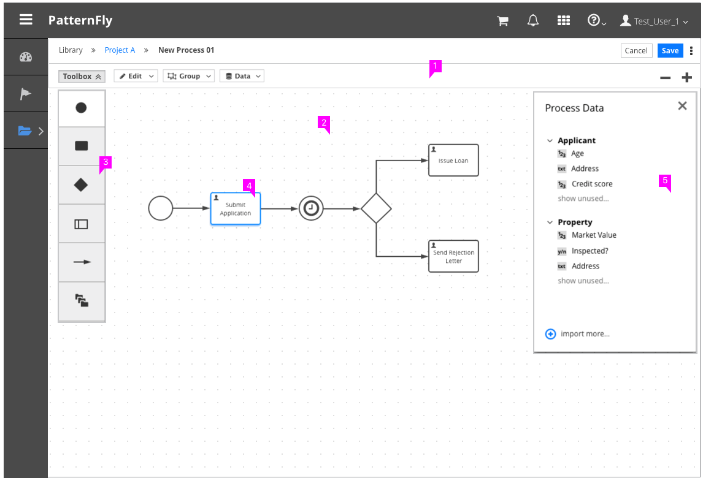
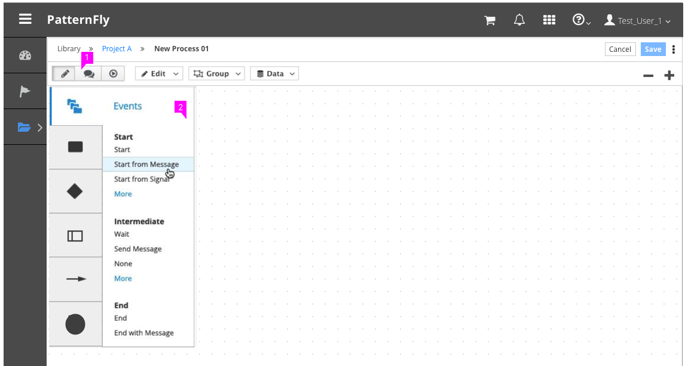
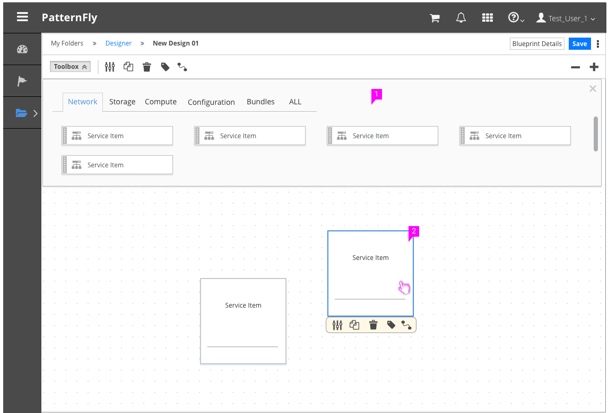
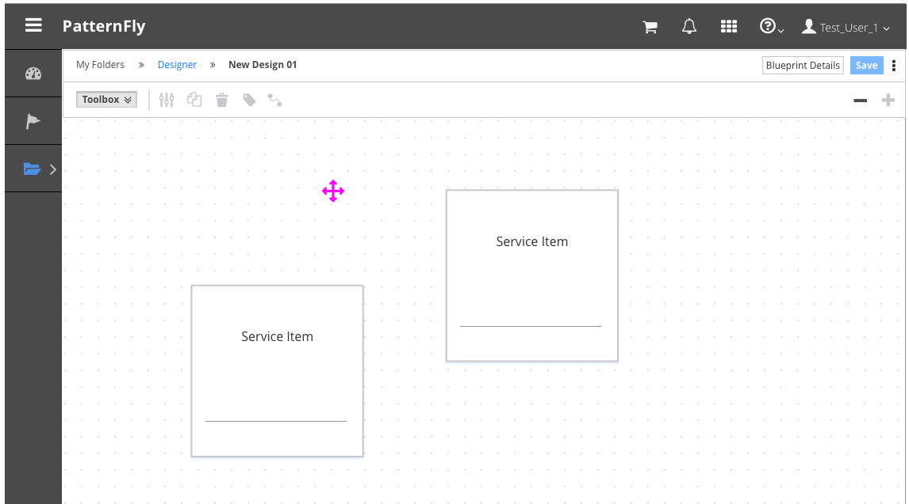

# Canvas View

  1. **Editor Toolbar:**  The Editor Toolbar includes a mechanism to open and close the Toolbox as well as actions pertaining to the items on the canvas. The Toolbar can also optionally include zoom/pan actions, find, and view types.
  1. **Canvas:** A grid based background should cover the working area of the Canvas View. Users can drag items from the toolbox, onto the canvas and arrange the items as needed.
  1. **Toolbox:**
      - All items that can be dragged onto the canvas are available in the Toolbox.
      - The toolbox can be left-aligned or top-aligned depending on the use case.
  1. **Canvas Items:** Canvas items are things that have been dragged from the toolbox onto the canvas. In some cases items can be ordered or connected to represent a particular flow of information.
  1. **Properties Panel** (optional):
      - Users may need to view or edit the properties of individual canvas items.
      - When a user selects an item to view the properties, a panel should appear on the right side of the canvas.
      - It should be clear which item properties are being displayed and users should have the ability to hide or collapse the properties panel as needed.

## Example of Left-aligned Toolbox with Fly-out Menus

  1. **Toolbar:** If more than one type of toolbox must exist, a button group may be used in the Editor Toolbar to open and close one toolbox at a time.
  1. **Toolbox:** With left-aligned toolboxes, fly-out menus can be used as needed for scalability.  

## Example of Top-aligned Toolbox

  1. **Toolbox:** With top-aligned toolboxes, tabs and scroll capability can be used as needed for scalability.
  1. **Canvas Items:** When a user clicks on a canvas item, the selected state should be visually indicated. For cases where multiple actions are available, a contextual menu of canvas item actions is recommended on hover.

## Zooming and Panning on the Canvas
Implementing the pan and zoom functionality is optional, but is recommended for any canvas view that has the potential for becoming overcrowded with canvas items.

### Zooming
- The fa-minus and fa-plus icons should be used as the action buttons for zooming in and out of the canvas.
- The default zoom level will be considered 100% zoom. The + button is disabled at this zoom level.
- Clicking the fa-minus button once will cause the canvas to transition to 75% of the original zoom level.
- Zooming out a second time will redraw the canvas at 50% of the original size. This will be the most zoomed-out state of the canvas.

### Panning
- Clicking and dragging on the canvas background when the cursor is in the all-scroll state will pan the canvas.
- When the canvas is not zoomed out all the way, hovering over the canvas background will change the mouse pointer to “cursor:all-scroll”.
- When it is zoomed out all the way, the cursor property will be set to “cursor: default”.
