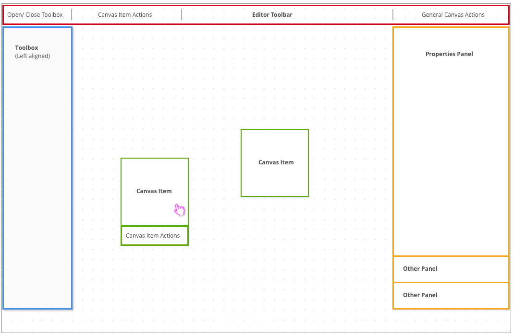
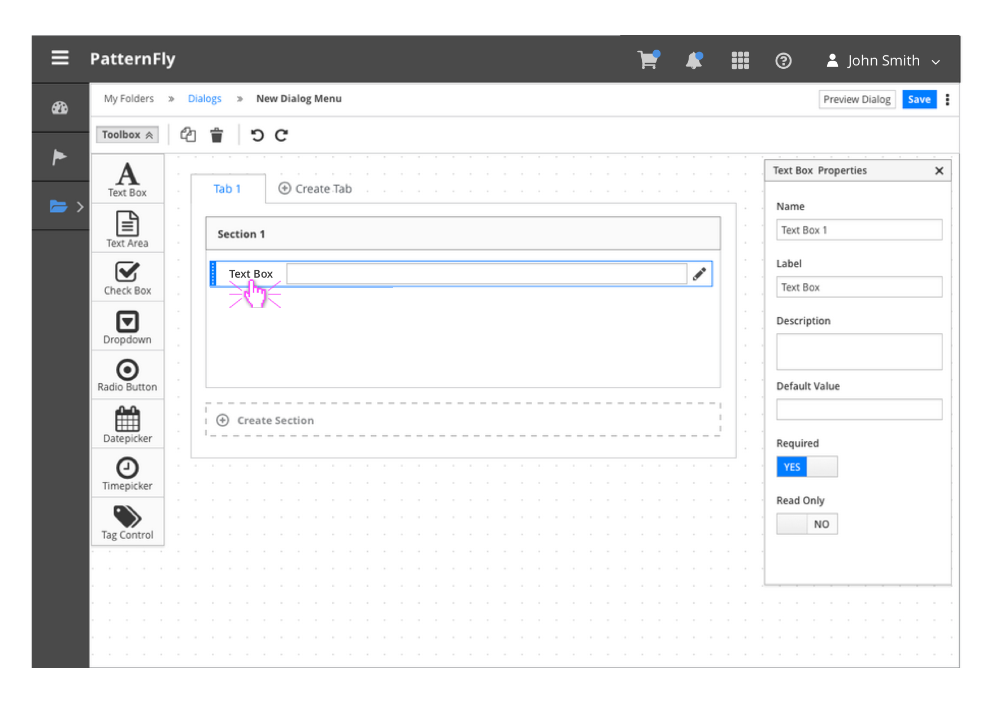

# Canvas View

The Canvas View allows users to create and edit content on a canvas. The editable area, or canvas, is positioned in the center of the page, while all corresponding panels and toolbars surround the canvas. Users can drag items from the toolbox onto the canvas and arrange the items as needed.
Follow the [Drag and Drop](http://www.patternfly.org/pattern-library/forms-and-controls/drag-and-drop/) framework for specifics on the interaction.

The canvas can be viewed as a single receptacle onto which toolbox items can be dragged anywhere. In some cases, there may be container objects on the canvas into which toolbox items can be dragged.

In some cases, items on the canvas can be ordered or connected to represent a particular flow or interaction. All tools associated with the items can be found above the canvas in the Editor Toolbar.

## Layout

## Example with Left-aligned Toolbox
The Canvas View is typically embedded into a page that has breadcrumbs and some navigation framework.

