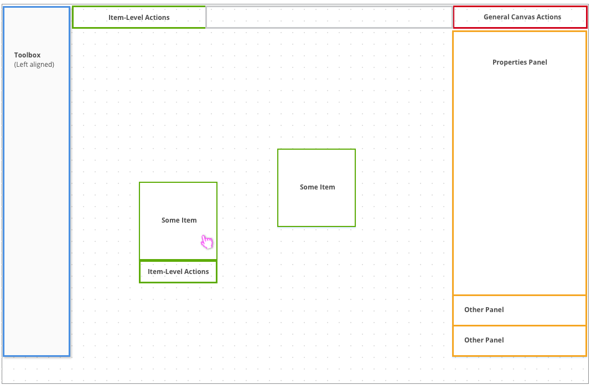
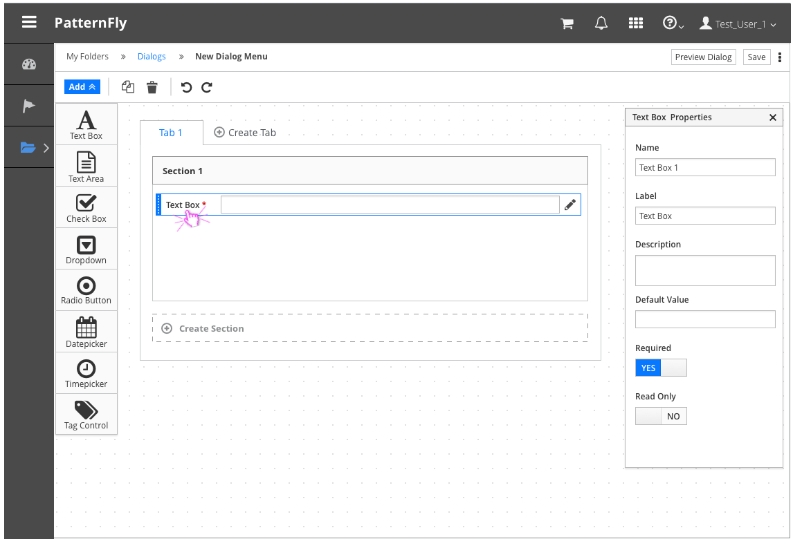

# Canvas View

The Canvas View allows users to edit content on a canvas. The editable area, or canvas, is positioned in the center of the page, while all corresponding panels and toolbars surround the canvas.  The Canvas View should be used for item or content creation. Users are able to create new content by arranging smaller components.
Follow the [Drag and Drop](http://www.patternfly.org/pattern-library/forms-and-controls/drag-and-drop/) framework for specifics on that interaction.

## Layout

## Example with Left-aligned Toolbox

