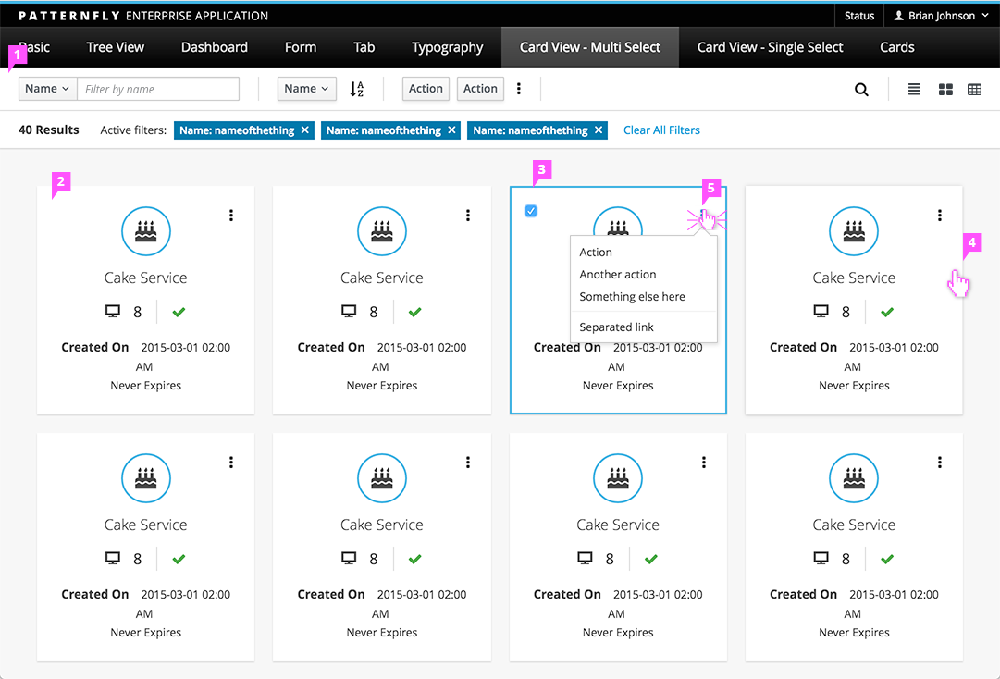

# Card View

## Description

1. **Toolbar:** The [Toolbar](http://www.patternfly.org/pattern-library/forms-and-controls/toolbar/) pattern may include Filter, Sort, Actions, Find and Change View. If the user can add new objects that will appear in the view, and Add action should be included here.
1. **Card:** The card is a container for displaying content about an object. At a minimum each card should be uniquely identified with the name of the object that it represents.
  - Each Card should have the same layout.
    - When including titles, make the title bold rather than appending a colon.
    - Links may be displayed within a card.
  - The number of cards in each row may decrease when the viewport size is decreased.
  - Use tooltips as necessary.
1. **Selection:**
  - When only single-select is supported, a user can drill down on a card by clicking on it.
  - If multi-select is supported, a checkbox will be displayed when the user hovers over a card. When the checkbox is clicked, that card is selected which is indicated by the check mark in the checkbox as well as a blue outline on the card. The selected checkbox will be shown as long as the card remains selected. Actions in the Toolbar apply to all selected cards.
  - For multi-select on mobile devices, checkboxes should be displayed at all times and should use the device default checkbox rather than the PatternFly checkbox.
1. **Card Hover:** A visual indication is shown when the user hovers over a card.
1. **Inline Actions:** Inline actions should be included if the user needs to be able to quickly perform an action on a single card. Very large numbers of actions should be placed in the Actions section of the Toolbar rather than on the card. See [Card Variations](http://www.patternfly.org/pattern-library/content-views/card-view/#/card-variations) for some ways that you may represent inline actions on cards.

## Additional Notes about Behavior

- **Empty State:** If no cards exist to be displayed, display an Empty State page. See the [Empty State](https://www.patternfly.org/pattern-library/communication/empty-state/#_) pattern for more details. If there are no items to display as the result of a null filter result, see the [Filter](http://www.patternfly.org/pattern-library/forms-and-controls/filter/) pattern for more information about how to display this.
- **Loading State:** If content is not loaded, display the  [Loading State](http://www.patternfly.org/pattern-library/communication/loading-state/) pattern.
- **Pagination:** Card View can also support pagination. See [Pagination](http://www.patternfly.org/pattern-library/navigation/pagination/) for more details.
- **Vertical Scroll:** Use a vertical scrollbar as needed. A horizontal scrollbar should NOT be used. Instead, the page containing the Card View should be responsive.
- **View Selector:** If alternate views are supported, a [View Selector](http://www.patternfly.org/pattern-library/forms-and-controls/view-selector/#design) will be displayed in the top right corner. This will allow the user to switch to another view.
