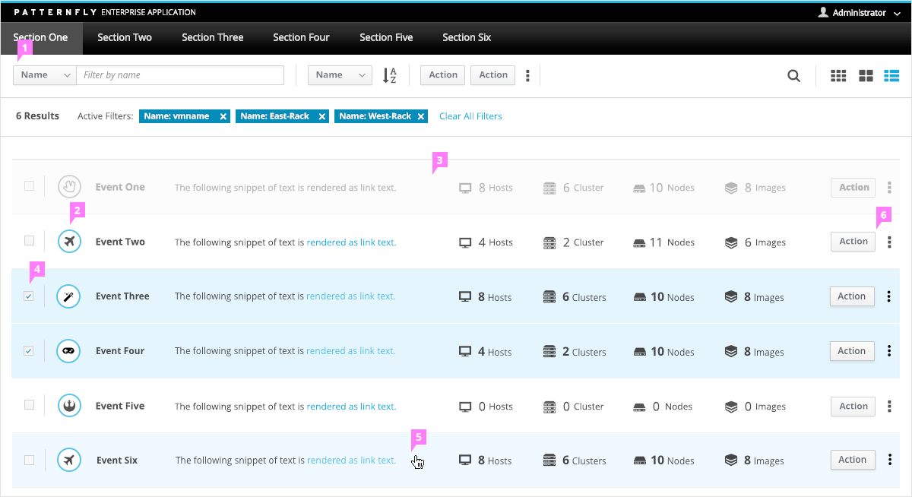
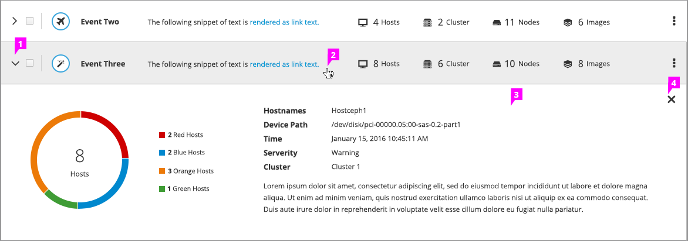
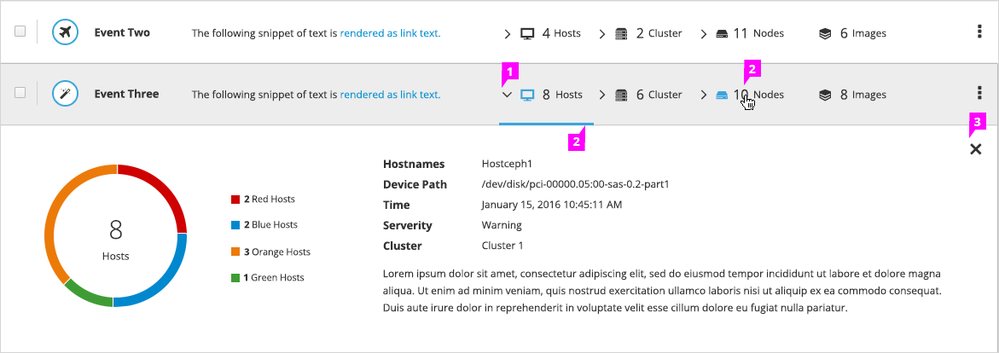

# List View

## Standard List View

1. **Toolbar:** The [Toolbar](https://www.patternfly.org/pattern-library/forms-and-controls/toolbar) pattern may include Filter, Sort, Actions, [Find](https://www.patternfly.org/pattern-library/forms-and-controls/find) and Change View.

1. **Row:**
  - If drill down behavior is supported, clicking on an item will link to the appropriate page.
  - Each item in List View should have the same layout
    - When including titles, Make the title bold rather than appending a colon ( : )
    - inks may be displayed within an item
  - When the viewport size is decreased:
    - Content should wrap, displaying multiple rows of data
    - Content could be eliminated

1. **Disabled Row** (optional): Rows that are currently not available will be disabled. The cursor should appear visually disabled when user hovers over the row.

1. **Multi-Selection via Checkboxes** (optional): If multi-selection is supported, checkboxes appear on the left. Actions in the Data Toolbar apply to the selected items.

1. **Item Hover:** A hover state should be shown visually when a user hovers over an item.

1. **Inline Actions:** Inline actions should be included if the user needs to be able to quickly perform an action on a single item.

## List View with Simple Expansion

1. **Icon:** Placing the caret at the front of the row signifies that this row is expandable. The caret icon points to the right when it is closed and down when it is expanded.

1. **Interaction**
  - Hovering over a row highlights it. Single clicking anywhere in the row expands the row.
  - If the list supports both expansion and drill-down to details, a button or link must be added to the row to support the drill-down action.

1. **Expansion Panel:** When the row is expanded, a panel is inserted between the bottom of the row and the top of the next row. All other content is pushed down the page. The panel should be sized to accommodate the content. Content can be anything that is required to convey details of a selected object. However, we do not recommend placing tables of log lists of items inside the expansion panel. This could result in nested scrolling (i.e. the master list and the detailed content require separate scroll bars).

1. **Close/Collapse:** Clicking the Close icon will collapse the expansion panel and return the list to its original (collapsed) state. Alternatively, clicking anywhere on the row again will have the same effect.

## List View with Compound Expansion

1. **Icon:** When the list supports compound expansion, the caret is placed in front of each attribute that is expandable.

1. **Expandable Attribute:**
  - Hovering over an expandable attribute highlights it. Note that in this case there is no action that applies to single clicking on the entire row. The user must explicitly click on the element they want to expand.
  - Clicking on any expandable attribute opens the expansion panels with details for the selected attribute, only. The caret changes direction to point down, and the attribute remains highlighted.
  - Hovering over another expandable attribute will highlight it. Clicking will close the current expansion panel and expand this attribute by opening its row expansion. This action is exactly equivalent to closing the first panel (by clicking close) and expanding the second panel.

1. **Close/Collapse:** Click the Close icon to close/collapse the expansion panel.

## Additional Notes about Behavior

- **Empty State:** If no items exist, display an Empty State page. See the [Empty State](https://www.patternfly.org/pattern-library/communication/empty-state/#_) pattern for more details. If there are no items to display as the result of a null filter result, see the [Filter](http://www.patternfly.org/pattern-library/forms-and-controls/filter/) pattern for more information about how to display this.

- **Vertical Scroll:** Use a vertical scrollbar as needed. A horizontal scrollbar should NOT be used. Instead, the page containing the List View should be responsive.

- **Pagination:** List view can also support pagination. See [Pagination](http://www.patternfly.org/pattern-library/navigation/pagination/) for more details.
