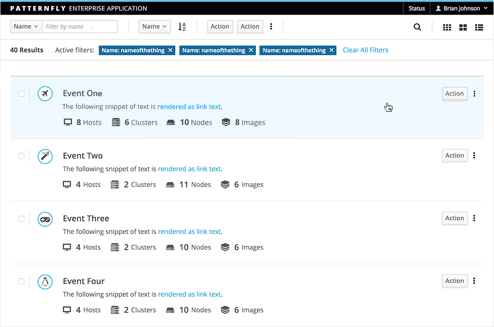
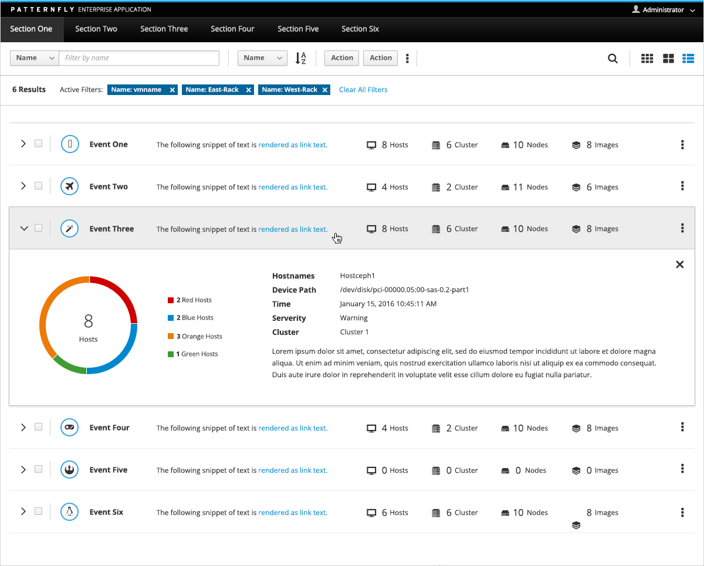
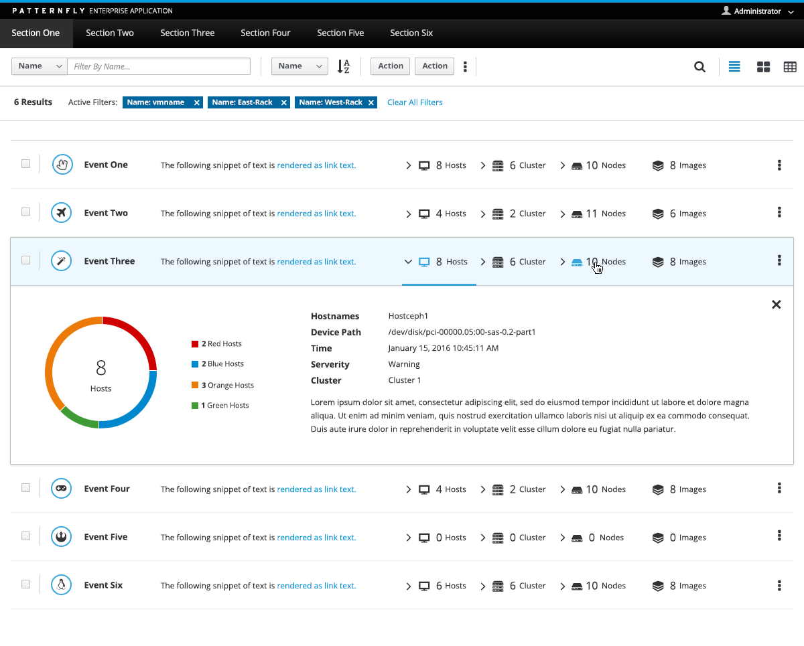
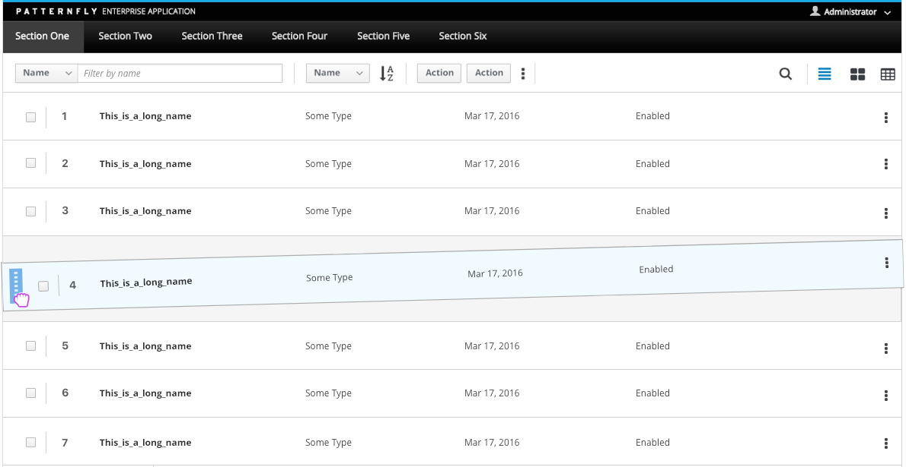
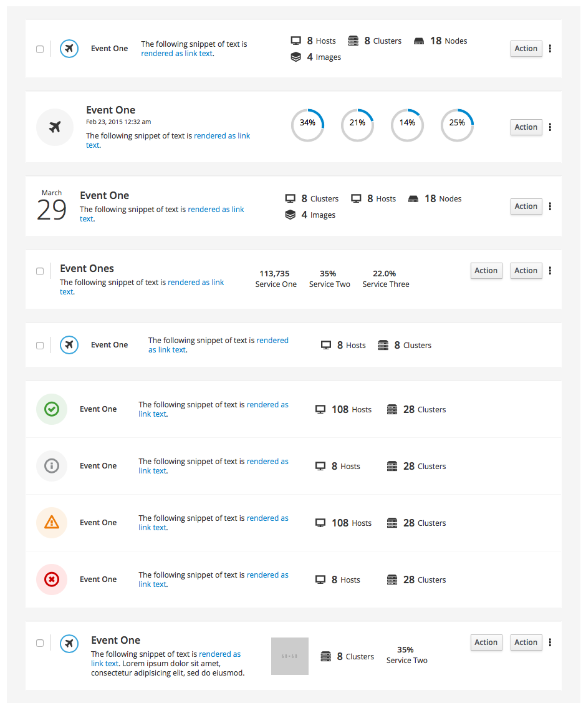

# List View

A List View displays data in rows. Each row displays the same set of attributes, although not necessarily displayed in columns, and the attributes may wrap. The List View omits column headers and other visual noise, making it a cleaner visualization than a [Table View](http://www.patternfly.org/pattern-library/content-views/table-view/).

Jump to [Standard List View](#standard-list-view), [List View with Expanding Rows](#list-view-with-expanding-rows) or [Row Variation Examples](#row-variation-examples)

## Standard List View

[View full page example](https://www.patternfly.org/pattern-library/content-views/list-view/list-view.html#_)

## List View with Expanding Rows

Use a List View with expanding rows when you want to display details in place without requiring drill-down to a new page. This is useful when you want to allow users to view details of an object without reloading the page, or when the detail information is small and does not require its own page. Simple expansion and compound expansion are two variants of this pattern.

### Simple Expansion

Simple expansion supports a single expansion state to expose more detail for a selected row.

### Compound Expansion

Compound expansion supports multiple expansion panels to examine multiple attributes of the selected row.

## List View with Draggable Rows

Provide customizable sorting capabilities to users by applying the [Drag and Drop](https://www.patternfly.org/pattern-library/forms-and-controls/drag-and-drop/#/api) pattern to a standard List View. Drag and Drop allows users to dynamically reorder items in the list.

## Row Variation Examples

The following row variations provide some examples of how you might visualize content within a row. You are not limited to these layouts. You may need to adjust the visualizations to best fit your application’s needs. Each row within a List Vsiew should have a consistent layout. Do not mix and match.

