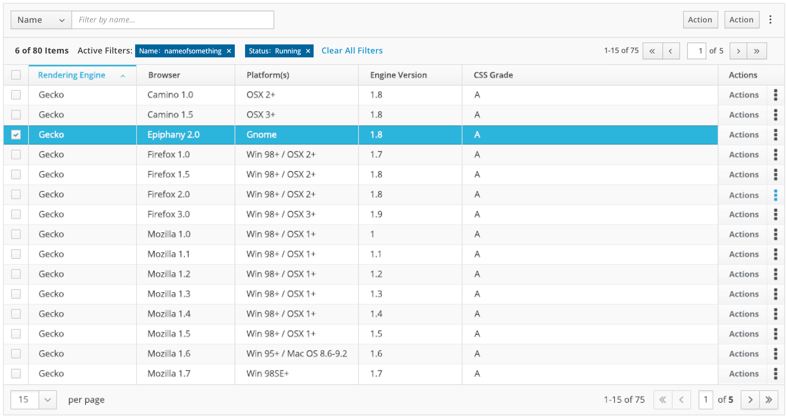
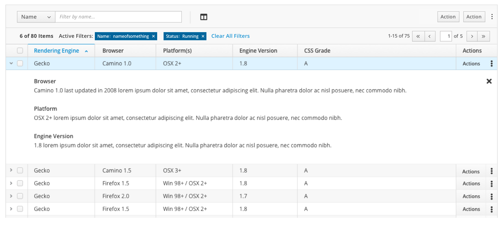

# Table View

Table View organizes data into rows (of items) and columns (of item attributes). Tables make structured data easy to scan, compare, sort, and analyze. Tables can be embedded into other design patterns. Tables are familiar to users and often the correct choice for structured data, but be careful not to overuse tables. The table pattern should **NOT** be used if:

- Users need to find patterns within a data set. Consider a [Line Chart](http://www.patternfly.org/pattern-library/data-visualization/line-chart/) or a [Bar Chart](http://www.patternfly.org/pattern-library/data-visualization/bar-chart/).
- Users need to browse the data set without knowing exactly what to look for. Consider using a [List View](https://www.patternfly.org/pattern-library/content-views/list-view/#/api).

#Table View with Simple Expansion

Use a Table View with expanding rows when you want to display details in place without requiring drill-down to a new page. This is useful when you want to allow users to view details of an object without reloading the page, or when the detail information is small and does not require its own page.

