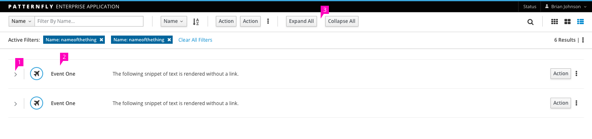
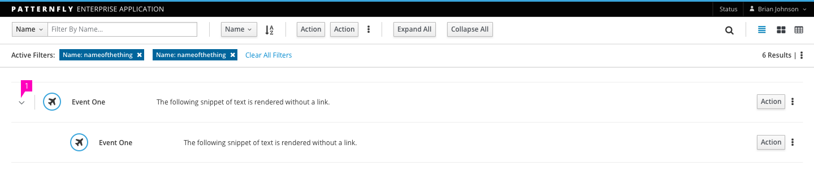
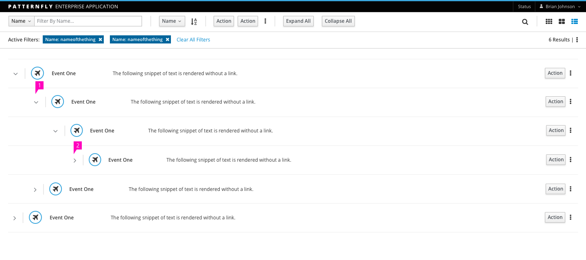
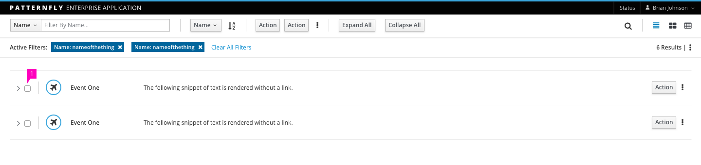
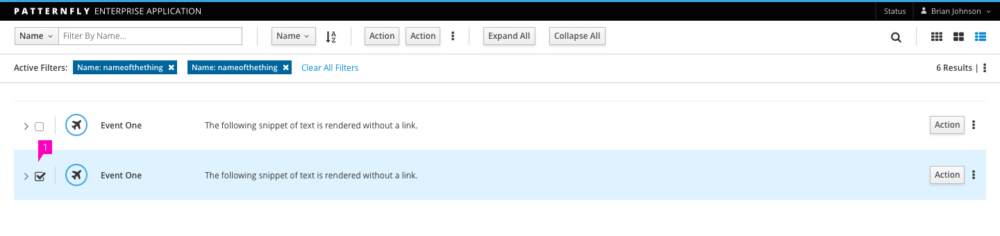

# Tree List View

## Standard Tree List View

1. **Show/Hide Child Elements:**
  - Click the element's caret to expand the closed element and show any child elements.
  - Click the element's caret to collapse the open element and hide any child elements.
2. **Row:**
  - Clicking on the row will be expand it, displaying any child elements.
  - Each item in the Tree List View should have the same layout. Even if child elements do not have all of the same information as their parent elements, they should be laid out in the same manner.
  - When including titles, make the title bold, rather than appending a colon between it and a description.
  - Links may be displayed only on the item title. Clicking this link can do one of two things, depending on your usage:
    - If you have a Detail Panel, clicking the row will show that Detail Panel with details of the selected row.
    - If you do not have a Detail Panel, it will navigate per standard link procedures.
  - Responsiveness:
    - When the viewport is decreased, the content should wrap, expanding the row height. If Titles and/or Descriptions are truncated, they must include [tooltips](http://www.patternfly.org/pattern-library/widgets/#tooltip).
3. **Toolbar:**
  As the Tree List View has the ability to expand or collapse multiple elements, the toolbar has been updated to support expansion and collapsing of all elements via a single action.
  - Click the action 'Expand All' to expand all closed elements, showing all child elements in the list. This should not affect any currently expanded elements.
  - Click the action 'Collapse All' to collapse all open elements. This should not affect any current collapsed elements.
4. **Hovering Rows:**
  - Hovering over any row will highlight it. Clicking the caret will open the next set of child elements, while keeping previously opened parent elements open.

## Tree List View with Single Child Expansion

1. **Show Child Elements:**
  - Hovering over the row highlights it.
  - Clicking on either the caret icon or row body will show all of the child elements associated with that particular row. Once a row is opened, clicking on the caret or row body will close that element.

## Tree List View with Multi-Child Expansion

The Tree List View with Multi-Child Expansion performs similarly to the Single Child Tree List View.

1. **Show Child Elements:**
  - When clicking the caret, if there are child elements of the initial row's children, those elements are not opened.
  - Hovering over another expandable attribute will highlight it.

1. **Show Multiple Child Elements:**
  - If an element has already been expanded, clicking the caret on the child element will open the next set of child elements, while keeping previously opened elements (now parents) open with their highlight and active border.

## Optional: Tree List View with Checkboxes

If desired, checkboxes can be added to the Tree List View. They will reside between the expansion caret and the pipe, and will allow for multi-selections in accordance with the toolbar.

Selecting a checkbox will highlight the row in blue.

## Additional Notes about Behavior

- **Recommendations:** We recommend that you use this pattern to go six layers deep. Any more than that will exceed the design expectations and cause rendering issues.

- **Empty State:** If no items exist, display an Empty State page. See the [Empty State](https://www.patternfly.org/pattern-library/communication/empty-state/#_) pattern for more details. If there are no items to display as the result of a null filter result, see the [Filter](http://www.patternfly.org/pattern-library/forms-and-controls/filter/) pattern for more information about how to display this.

- **Vertical Scroll:** Use a vertical scrollbar as needed. A horizontal scrollbar should NOT be used. Instead, the page containing the Tree List View should be responsive.

- **Pagination:** The Tree List view can also support pagination. See [Pagination](http://www.patternfly.org/pattern-library/navigation/pagination/) for more details.
