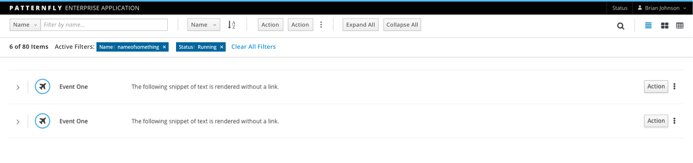
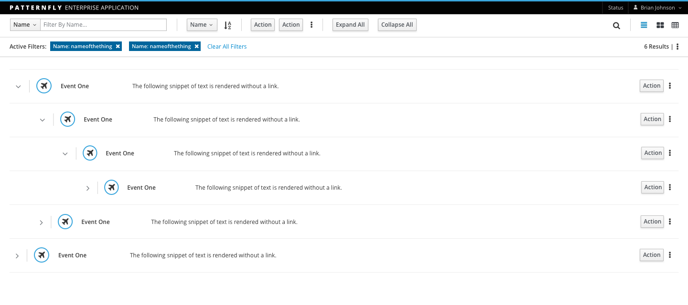
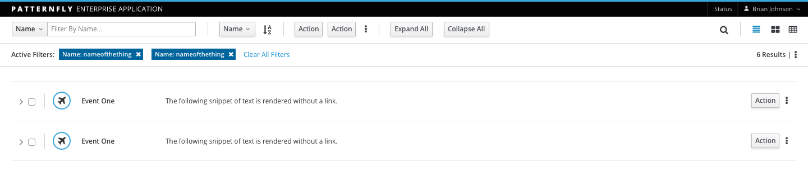

# Tree List View

The Tree List View is used to display hierarchical data (parent-child relationships) in an easy to understand, clean view.

A Tree List View displays data in rows. Each row displays the same set of attributes, although not necessarily displayed in columns, and the attributes may wrap. The Tree List View may omit column headers and other visual noise, making it a cleaner visualization than a data table.

Jump to [Standard Tree List View](#standard-tree-list-view), [Tree List View with Single Child Expansion](#tree-list-view-with-single-child-expansion) or [Tree List View with Multiple Child Expansion](#tree-list-view-with-multiple-child-expansion)

## Standard Tree List View

## Tree List View with Single Child Expansion

Use a Tree List View with Single Child expansion when you want to display child elements in a list. This is useful when you want to allow users to view an element that may be linked to another item, or when you want to quickly see the relationship between two items. Single Child expansion and Multi-Child expansion are two variants of this pattern.

## Tree List View with Multiple Child Expansion

Use a Tree List View with Multi-Child expansion when you want to display multiple child elements in a list. This will give you an expanded view of the relationship between elements.

## Optional: Tree List View with Checkboxes

Use a Tree List View with checkboxes when you want the ability to expand or collapse multiple parent/child elements at once.

<!-- ## Draggable Rows

Provide customizable sorting capabilities to users by applying the [Drag and Drop](https://www.patternfly.org/pattern-library/forms-and-controls/drag-and-drop/#/api) pattern to a standard list view. Drag and Drop allows users to dynamically reorder items in the list.

 -->
