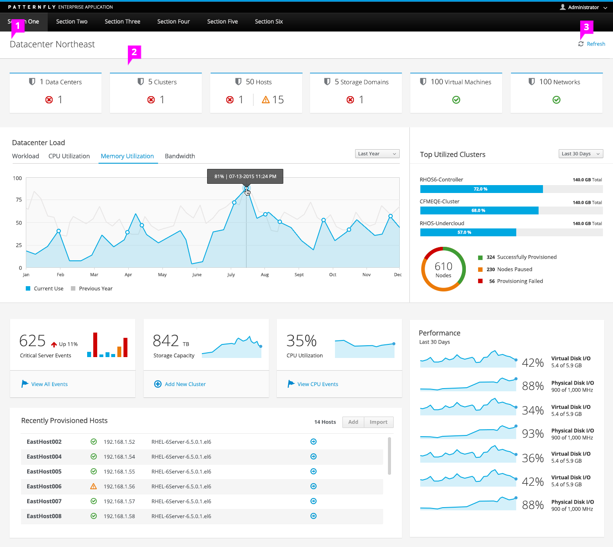

# Dashboard Layout

  1. **Dashboard Title Panel** (optional): A panel may be placed at the top of the page, flush to the top/left/right with a white background. This space may be used to contain a dashboard title, refresh action or trend filter. Place the title left-aligned within this panel.

  1. **Background:** Use a grey background color (#f5f5f5) for the dashboard page.

  1. **Refresh Action** (optional): If the dashboard needs a Refresh action so that the user can manually refresh, place it on the right of the Dashboard Title Panel.
