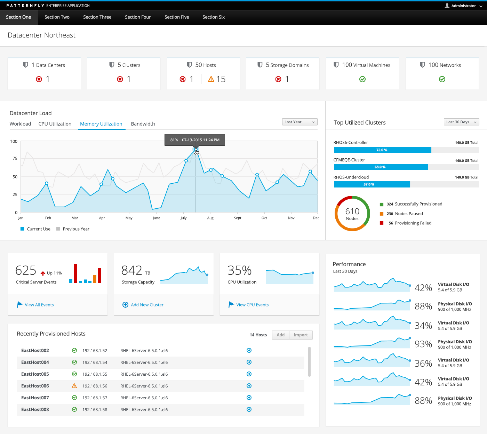

# Dashboard Layout

This section provides guidance on laying out a dashboard page, and does not currently include editable dashboard requirements. When creating a dashboard layout, use the [column grid system](http://getbootstrap.com/css/#grid).

