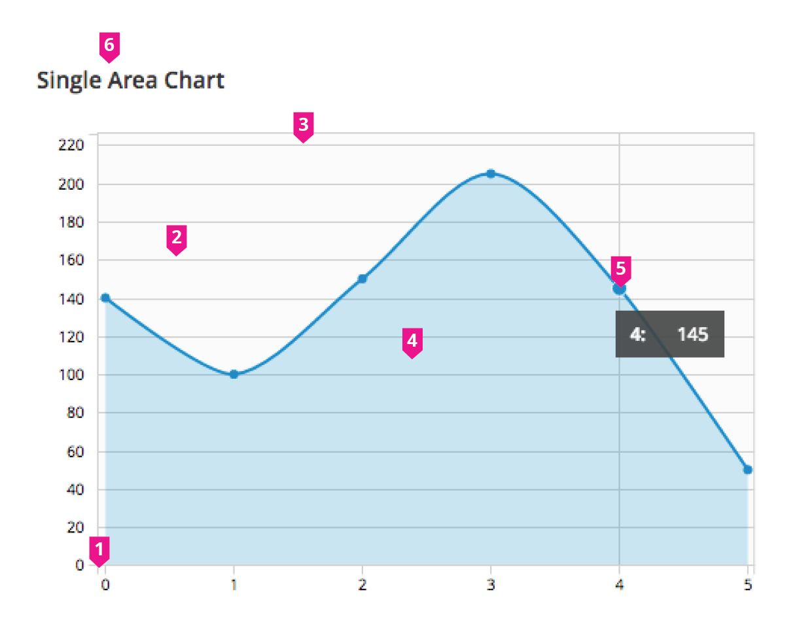

# Area Chart

## Single Area Chart

  1. **Axis Lines:**
    - The “x” axis is commonly used for time values, and the “y” axis is used for metric values.
    - Use consistent spacing for the axis line intervals and tick marks.
    - Tick marks are optional.

  1. **Grid Lines:**
    - Horizontal grid lines (recommended): The lines help users associate a point in the chart with a value on the axis.
    - Vertical Grid lines (optional): While helpful, in some contexts they might create visual noise.

  1. **Data Line:**
    - A solid line is used at the top of the area chart to show a total value.
    - Use straight lines (linear interpolation), if it’s important to display more precise data values.

  1. **Data Area Fill:**
    - The area fill is presented below the data line.
    - Data area fills use colors that conform with the PatternFly color palette.

  1. **Interactive Data Points:**
    - Specific data points may be represented by dots on the line portion of the area chart.
    - To help the user see which point they are hovering, the dot expands and a vertical line is displayed. In addition, a tooltip should appear with the associated values for that specific point in time.

  1. **Chart Title:**
    - Provide a title that describes the chart.

  1. **Legend** (optional)**:**
    - Provide a legend that associates the individual data point with a color mapping. It may be used to provide more detailed information in support of the chart title. Position the legend below, or to the right of the chart.
