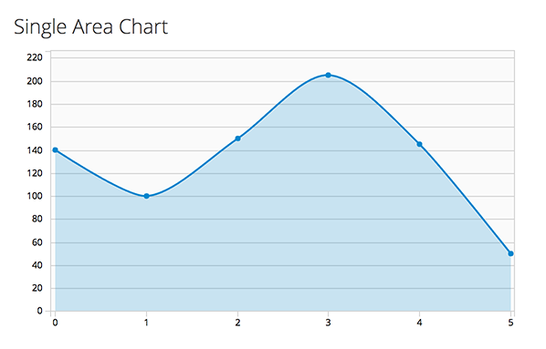

# Area Chart

A Single Area Chart is used to provide metrics for a single data point. While similar to a line chart in both form and function, it offers an area fill for visual emphasis. The area fill below the line also functions to indicate cumulative data.

  - The most common use case for area charts is to show trending over a continuous scale (usually time.)
  - Use this instead of a line chart when you need to provide more visual emphasis than a simple line chart would offer. See the [Line Chart pattern](https://www.patternfly.org/pattern-library/data-visualization/line-chart/) for more information about line charts.

