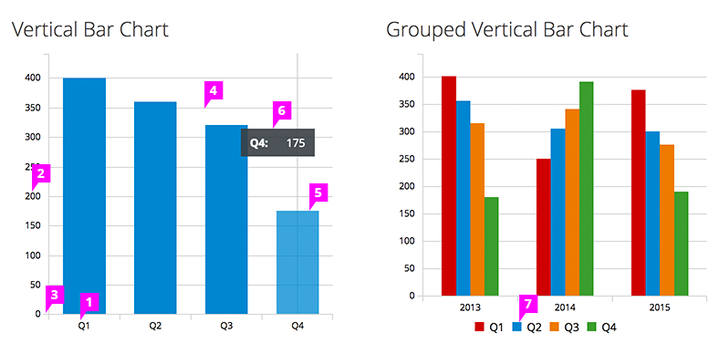
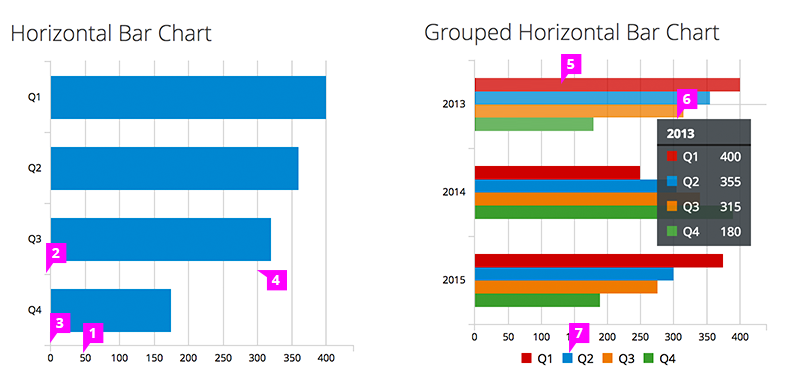

# Bar Chart

  1. **Horizontal Axis Labels:**
      - Horizontal axis labels display the series names and are recommended, but can be omitted if necessary due to space constraints and responsiveness. If omitted a legend must be available.
  1. **Vertical Axis Labels:** Vertical axis labels display values.
  1. **Axis Tick Marks** (optional): There can be both major and minor tick marks on the vertical axis of vertical charts. Tick marks are not needed on the horizontal axis of vertical charts since the horizontal axis of a vertical bar chart is not a quantitative scale line.
  1. **Grid Lines** (optional): Horizontal grid lines are suggested for vertical charts, but should not be used with horizontal bar charts.
  1. **Bar:**
      - **Interaction:**
        - If drill down behavior is supported, clicking on a bar will navigate to the appropriate page.
        - If supported, right clicking on an bar will bring up a menu with associated actions. If you are using a grouped bar chart, right clicking on a group will bring up a menu with associated actions for that group.
      - **Width:** All bars should be the same width.
      - **Color:** For recommendations on fill colors, see the [Color Palette](https://www.patternfly.org/styles/color-palette/).
      - **Height:** Bar height in vertical charts is the dimension that represents its value.
      - **Spacing:** Spacing between bars should be equal. In the case of grouped charts, increase the spacing between main categories.
  1. **Tooltip:** We recommend that the series name and value are displayed on hover.
  1. **Legend:** It is recommended to include a legend to define the colors on the chart. On the bar chart, the legend may be located left aligned and underneath the chart or left aligned and to the right of the chart.
      - **Interactive Legend** (optional): Clicking on a series in the legend should toggle the visibility of the series in the chart.
  1. **Stacked Bar** (optional): The first series name is represented by the topmost stacked bar, and the last series name is represented by the bottommost stacked bar. This order should not be reversed.

  1. **Horizontal Axis Labels:** Horizontal axis labels display values.
  1. **Vertical Axis Labels:** Vertical axis labels display the series names and are recommended, but can be omitted if necessary due to space constraints and responsiveness. If omitted a legend must be available.
  1. **Axis Tick Marks** (optional): There can be both major and minor tick marks on the horizontal axis of horizontal bar charts. Tick marks are not needed on the vertical axis of horizontal charts since the vertical axis of a horizontal bar chart is not a quantitative scale line.
  1. **Grid Lines** (optional): Vertical grid lines are suggested for horizontal charts, but should not be used with vertical charts.
  1. **Bar**
      - **Interaction:**
        - If drill down behavior is supported, clicking on a bar will navigate to the appropriate page.
        - If supported, right clicking on an bar will bring up a menu with associated actions. If you are using a grouped bar chart, right clicking on a group will bring up a menu with associated actions for that group.
      - **Width:** All bars should be the same width.
      - **Color:** For recommendations on fill colors, see the [Color Palette](https://www.patternfly.org/styles/color-palette/).
      - **Length:** Bar length in horizontal charts is the dimension that represents its value.
      - **Spacing:** Spacing between bars should be equal. In the case of grouped charts, increase the spacing between main categories.
  1. **Tooltip:** We recommend that the series name and value are displayed on hover.
  1. **Legend:** It is recommended to include a legend to define the colors on the chart. On the bar chart, the legend may be located left aligned and underneath the chart or left aligned and to the right of the chart.
      - **Interactive Legend** (optional): Clicking on a series in the legend should toggle the visibility of the series in the chart.
  1. **Stacked Bar** (optional): The first series name is represented by the leftmost stacked bar, and the last series name is represented by the rightmost stacked bar. This order should not be reversed.
