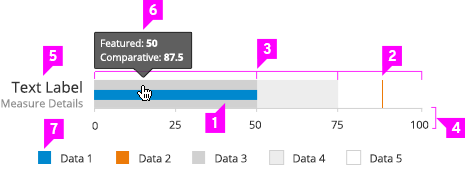
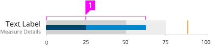
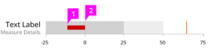
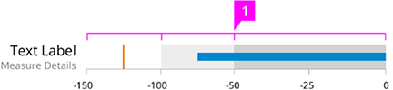
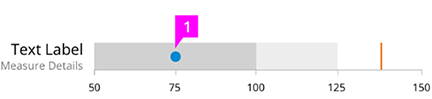
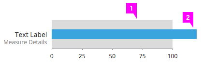
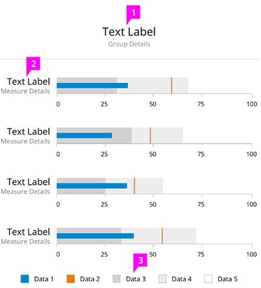
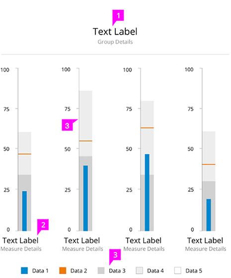

# Bullet Chart

Jump to [Standard Bullet Chart](#standard-bullet-chart), [Segmented Primary Measure](#segmented-primary-measure), [Negative Primary Measure](#negative-primary-measure), [Reversed Ranges](#reversed-ranges), [Scale Greater Than Zero](#scale-greater-than-zero), [Horizontal Group](#horizontal-group), or [Vertical Group](#vertical-group)

## Standard Bullet Chart

1. **Featured Measure Bar:** Use a visually prominent fill color for the featured measure bar. See the [color palette](https://www.patternfly.org/styles/color-palette/) for color recommendations.

2. **Comparative Measure Line** (optional):
  * Display up to two comparative measures using thin lines perpendicular to the featured measure bar.
  * The featured measure bar should appear below comparative measure lines in the case of an overlap.

3. **Qualitative Range Bars** (optional):
  * To show the qualitative state of primary and comparative measures, display two to five qualitative ranges (e.g., poor, good, excellent).
  * The qualitative range fill colors should be visually less prominent than the featured and comparative measures. See the [color palette](https://www.patternfly.org/styles/color-palette/) for color recommendations.

4. **Quantitative Scale:** Display a quantitative scale of equal intervals of measure along a single linear axis. Major tick marks should be displayed at each labeled interval. Minor tick marks can be displayed between major intervals if necessary.

5. **Text Label:**
  * The primary measure is labeled here.
  * Text labels should be placed above vertically-oriented graphs and to the left of horizontally-oriented graphs. See the Variations sections for more examples.

6. **Tooltip:** Display featured and comparative measures in a hover tooltip.

5. **Legend** (optional):
  * Include a legend to define the featured measure, comparative measures, and qualitative ranges.
  * Interactive Legend (optional): Clicking on a series in the legend should toggle the visibility of the series in the graph.

## Variations

### Segmented Primary Measure

1. **Segmented Primary Measure Bar:** Display a segmented primary measure to call out actual and projected primary measures.

### Negative Primary Measure

1. **Negative Primary Measure:** Use of a red fill color for the primary measure bar is recommended to emphasize values considered to be bad when they are low.

1. **Zero Line:** Display a vertical line at the zero mark on scales containing negative and	positive values.

### Reversed Ranges

1. **Reversed Qualitative Ranges:** Show reversed qualitative ranges for graphs containing measures	considered to be good when they are low.

### Scale Greater Than Zero

1. **Primary Measure Dot:** Display the primary measure as a dot when the scale starts at a value greater than zero.

### Measure Greater Than Max Range

1. **Primary Measure Bar:** Display the primary measure bar, which can optionally be segmented.

2. **Single Qualitative Range Bar:** Display the range bar, which represents the min and max values.

## Horizontal Group

1. **Group Label** (optional): Include a center-aligned text label above horizontally-oriented graphs.

2. **Graph Label:**
  * Position right-aligned text labels to the left of horizontally-oriented graphs.
  * Horizontal divider line (optional): Include a thin horizontal divider line between the group label and graphs below.

3. **Legend** (optional):
  * Include a legend to define the featured measure, comparative measures, and qualitative ranges.
  * Interactive Legend (optional): Clicking on a series in the legend should toggle the visibility of the series in the graph.

## Vertical Group

1. **Group Label** (optional):
  * Include a group label above vertical graph groups.
  * Horizontal divider line (optional): Include a thin horizontal divider line between the group label and graphs below.

2. **Graph Label:** Include a graph label below vertically-oriented graphs.

3. **Scale Position:** Place the scale on the left or right of vertically-oriented graphs. Scale position should be the same for all graphs in a group.

4. **Legend** (optional):
  * Include a legend to define the featured measure, comparative measures, and qualitative ranges.
  * Interactive Legend (optional): Clicking on a series in the legend should toggle the visibility of the series in the graph.
