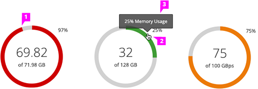
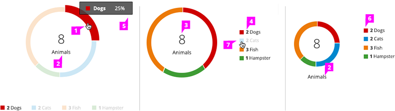

# Donut Chart

## Utilization

  1. **Donut Chart Fill:**
    - The background color is grey (#d1d1d1)
    - The fill starts at 12 o’clock and moves clockwise. The fill color depends on the thresholds.
      - When no thresholds exist the indicator is blue (#0088ce).
      - When a threshold exists and the percentage has not surpassed any thresholds, the indicator is green (#3f9c35).
      - When the utilization percentage has surpassed the warning threshold, but not the error threshold, the indicator is orange (#ec7a08)
      - When the utilization percentage has surpassed the error threshold, the indicator is is red (#cc0000).

  2. **Label or Icon** (optional):
    - When the Donut Chart is a part of a dashboard tile, there is a label in the center of the chart.
    - The label may be omitted or replaced by an icon if the chart is used in an object blade or card.
    - The label in the center of the chart should show one of the following:
      - The used value in a large font size followed by “<units> Used” on a second row.
      - The available value in a large font size followed by “<units> Available” on a second row.
      - The current percentage in a large font size followed by a “of <total value> <units>” on a second row.

  3. **Tooltip** (optional): When the Donut Chart is used to represent utilization, the percentage is displayed in a tooltip on hover.

  4. **Warning Threshold Indicator** (optional): If a warning threshold exists, that may be visually indicated on the chart. 75% is the typical default value for a warning threshold but some products may have configurable thresholds (design not currently shown, visuals are still TBD).

  5. **Error Threshold Indicator** (optional): If an error threshold exists, that may be visually indicated on the chart. 90% is the typical default value for an error threshold but some products may have configurable thresholds (design not currently shown, visuals are still TBD).

## Relationship of a Set of Values to a Whole

  1. **Donut Chart Fill:**
    - **Interaction** (optional):
      - If drill down behavior is supported, clicking on a segment of the donut will navigate to the appropriate page.
      - If supported, right clicking on a segment of the Donut Chart will bring up a menu with associated actions.
      - **Color:** For recommendations on fill colors, see the Color Palette.

  2. **Label or Icon:** When the Donut Chart is contained within a dashboard card, there is a label defining what the Donut Chart represents. The label may be shown either inside or outside of the Donut Chart.

  3. **Total Value** (optional): The total value of the data set may be shown in the center of the Donut Chart. It should be represented as a [total numeric value] + [data set label], for example: “8 Animals.” The label may wrap to a second line if necessary. If the information does not fit in the center of the doughnut, do not resize or otherwise modify the presentation. In that case leave the center empty and consider presenting the data in either the chart labels, a title, or tooltips.

  4. **Set of Values** (optional): It is recommended to show the values for each piece of the Donut Chart using the legend and in a tooltip on hover.

  5. **Tooltip** (optional): We recommend that the name and value are displayed on hover.

  6. **Legend:**
    - It is recommended to include a legend to show values and define the colors on the chart. There are a couple of locations for the legend:
      - Left aligned and centered underneath the chart
      - Left aligned and to the right of the chart

  7. **Interactive Legend** (optional): Clicking on a series in the legend should toggle the visibility of the series in the chart.
