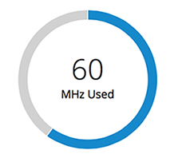
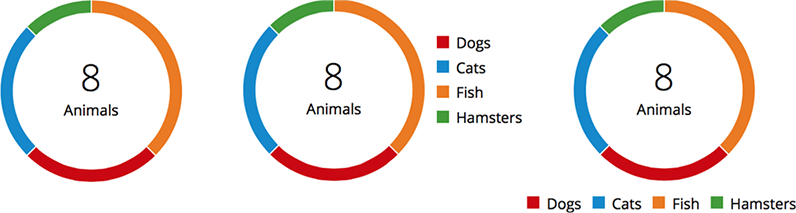
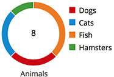

# Donut Chart

The most common use case for a donut chart are:
- Show progress completion as a percentage.
- Show utilization for an object (e.g. network, CPU, storage, etc.) as a percentage.
- Show the relationship of a set of values to a whole (design and specs for this use case are not addressed at this time, TBD.).

Jump to [Utilization](#utilization), [Relationship of a Set of Values to a Whole](#relationship-of-a-set-of-values-to-a-whole) or [Small Donut Chart](#small-donut-chart)

## Utilization
When using a donut chart to show utilization, the entire donut should add up to 100% and the fill represents a percentage of that. You can show that a threshold has been reach by using red, orange or green colors. Otherwise, use the blue color when thresholds are not present. Consider using the [Utilization Bar Chart](https://patternfly.org/pattern-library/data-visualization/utilization-bar-chart) to show utilization in more limited spaces.

## Relationship of a Set of Values to a Whole
When using a donut chart to show the relationship of a set of values to a whole, the pieces must add up to 100% and there should be no more than six categories. Sections within a donut chart may be hard to compare to each other so you should use a donut chart when you want to compare an individual section to the whole. Consider using a [Bar Chart](https://patternfly.org/pattern-library/data-visualization/bar-chart) if you would like to compare one category to another.

## Small Donut Chart

