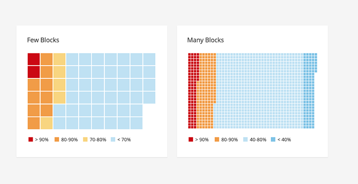
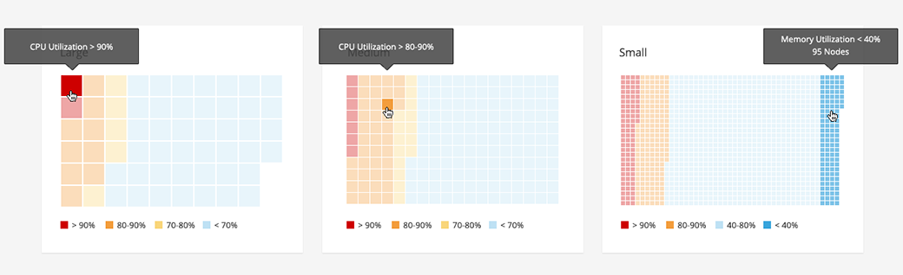

# Heat Map

The Heat Map is a visualization of objects as blocks in a grid. The blocks are colored to represent an attribute of the object, such as utilization rate. Using color allows the user to quickly access high level information for each object.  

When the Heat Map items become so small that they can no longer be meaningfully distinguished,  (differs by screen size/resolution) each section of tiny squares begins to act as a single unit grouped together by color. Hovering over a section displays a tooltip with a summary of the items in the section such as their count and which legend entry they represent.

Clicking on the section takes the user to the content view for that item type, filtered to show the items in the clicked section. Whether a single block or group is selected is determined by the size of individual blocks.

The most common use cases for the Heat Map are:
* Users need to quickly assess the utilization rate of objects in a data set. Colored blocks, indicating utilization percentages, provide "at a glance" status which aids in troubleshooting.
* Users need to scan the status of each object in a data set.

## Heat Map

## Heat Map Variations

