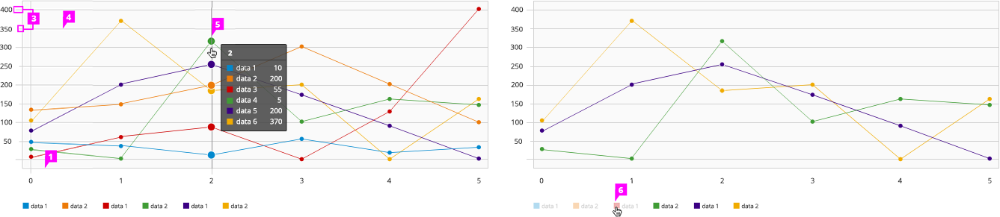

# Line Chart

  1. **Horizontal Axis Labels:** When visualizing data over a period of time, the horizontal axis labels display time
  1. **Vertical Axis Labels:** When visualizing data over a period of time, the vertical axis labels display values.
  1. **Axis Tick Marks** (optional): Major and minor tick marks on both axes may be shown.
  1. **Grid Lines** (optional):
   - Horizontal grid lines are recommended.
   - Vertical grid lines are not recommended.
  1. **Line:**
    - **Interaction** (optional): If supported, right clicking on an individual line will bring up a contextual menu with associated actions.
    - **Data Point:** Data points are visually represented as dots on the line. A user can view information related to a specific data point by hovering over it. To help the user see which point they are hovering, the dot expands and a vertical line is displayed. In addition, a tooltip should appear with the associated values for that specific point in time.
    - **Color:** For recommendations on line colors, see the Color Palette.
  1. **Legend:** It is recommended to include a legend to define the colors on the chart. On the line chart, may be left aligned and centered underneath the chart or left aligned and to the right of the chart.
    - **Interactive Legend** (optional): Clicking on a series in the legend should toggle the visibility of the series in the chart. Hovering over a series in the legend will highlight the blocks associated with that attribute.
