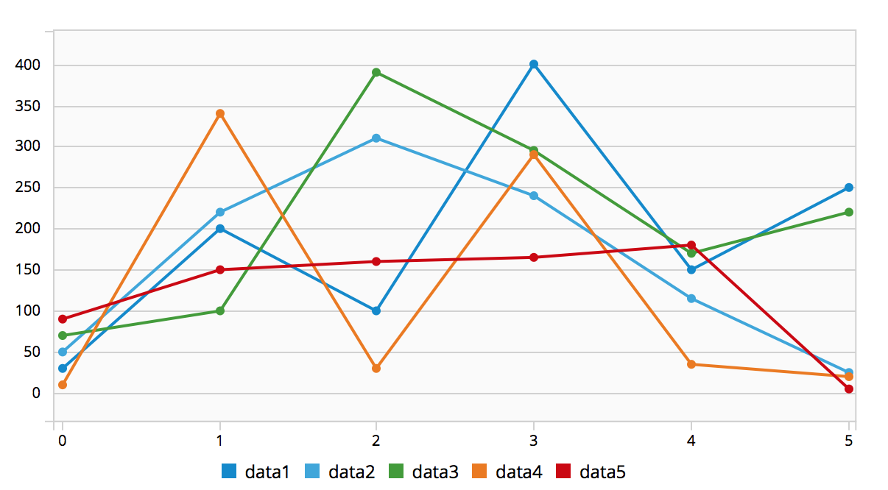
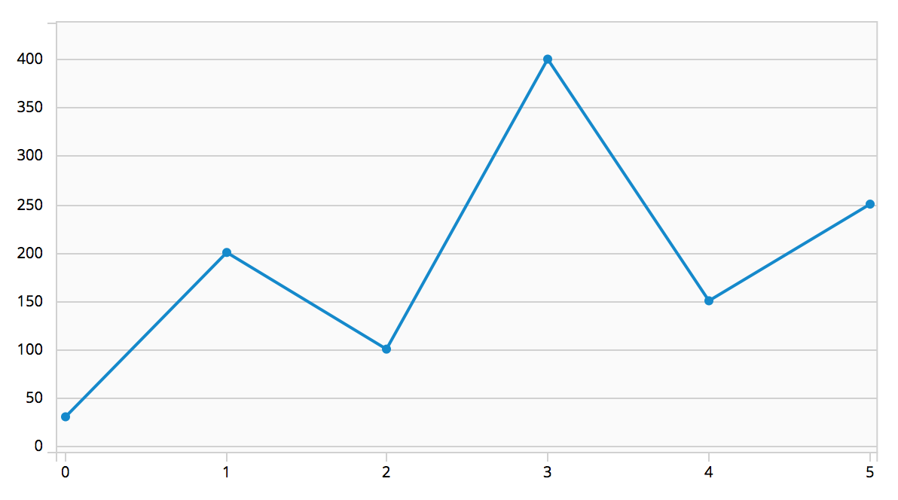

# Line Chart

## Overview
The most common use case for line charts is to compare several data sets, or to show data over a period of time. As a rule of thumb, line charts are a great way to show continuous data over time. If you want to show and compare categorical data, you may consider using a bar chart.

Multiple lines on the same chart allow the user to visualize relationships between varying data sets, such as correlated events, similarities or unexpected differences. We recommend displaying no more than 6 lines on a single graph to avoid confusion.

Jump to [Line Chart](#line-chart-example) or [Single Line Chart](#single-line-chart-example)

## Examples

### Line Chart Example

### Single Line Chart Example

