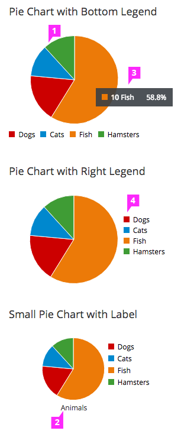

# Pie Chart

## Description

  1. **Pie Chart Fill:**
    - For recommendations on fill colors, see the [Color Palette](https://www.patternfly.org/styles/color-palette/).
    - **Interaction** (optional)**:**  
      -  If drill down behavior is supported, clicking on a segment of the pie will navigate to the appropriate page.
      - If supported, right clicking on a segment of the pie chart will bring up a menu with associated actions.

  1. **Label** (optional)**:**
    - The label may be shown either on top or bottom of the pie chart.

  1. **Tooltip** (optional)**:**
    - We recommend that the name and percentage are displayed on hover.

  1. **Legend:**
    - It is recommended to include a legend to show values and define the colors on the chart. On the pie chart, the legend may be located left aligned and underneath the chart or left aligned and to the right of the chart.
    - **Interaction** (optional)**:**
      - Clicking on a series in the legend should toggle the visibility of the series in the chart.
      - Hovering over a series in the legend will highlight the piece of pie associated with that attribute.
