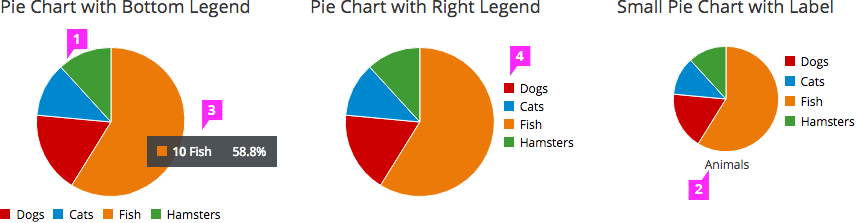

# Pie Chart

  1. **Pie Chart Fill:**
    - Fill colors should be based on the [PatternFly Color Palette](https://www.patternfly.org/styles/color-palette/).
    - **Interaction** (optional):  
      -  If drill-down behavior is supported, clicking on a segment of the pie will trigger an associated action or navigation.
      - If supported, right clicking on a segment of the pie chart will bring up a menu with associated actions.

  1. **Label** (optional): The label may be shown either on top or bottom of the pie chart.

  1. **Tooltip** (optional): We recommend that the name and quantity/percentage are displayed on hover.

  1. **Legend:** It is recommended to include a legend to show values and define the colors on the chart. On the pie chart, the legend should be left-aligned. It should be placed beneath or to the right of the pie chart.

    - **Interaction** (optional):
      - Clicking on a series in the legend should toggle the visibility of the series in the chart.
      - Hovering over a series in the legend will highlight the piece of pie associated with that attribute.
