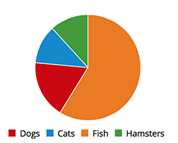
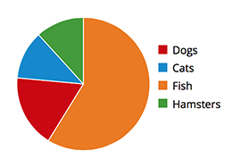
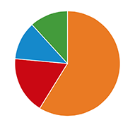
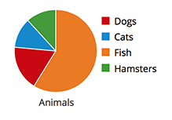

# Pie Chart

Pie charts are commonly used to show percentages or proportional data. It makes sense to choose a pie chart when you need to compare a set of values to a whole. For example, you might choose a pie chart when visualizing the number of sales made by a team of five people; each segment of the chart represents one salesperson's performance in the context of the rest of the team.

The sum of all of the segments of the chart must equal 100%, and the data points should be mutually exclusive. It is recommended that there are no more than six segments per single pie chart.

A pie chart may be the wrong choice when you need to compare categories to one another, because it can be difficult to distinguish small differences between segments. If you wish to compare values to each other, the [Bar Chart pattern](https://www.patternfly.org/pattern-library/data-visualization/bar-chart) may be a more effective pattern.

Currently, PatternFly has not collected user research data on this pattern. If you'd like to contribute to this documentation, please see our [Get Started guide](http://www.patternfly.org/get-started/contribute/) for details.

Jump to [Pie Chart with Bottom Legend](#pie-chart-with-bottom-legend), [Pie Chart with Right Legend](#pie-chart-with-right-legend), [Pie Chart with No Legend](#pie-chart-with-no-legend), or [Small Pie Chart with Label](#small-pie-chart-with-label)

## Pie Chart with Bottom Legend

## Pie Chart with Right Legend

## Pie Chart with No Legend
It would be appropriate to use a Pie Chart with no legend in situations where color makes a clear visual association to the data. However, you should consider the impact this will have on visually-impaired or colorblind users.

## Small Pie Chart with Label
The small pie chart can be used to conserve space in appropriate situations, but avoid reducing the size of the chart to the point that the segments are difficult to compare.

