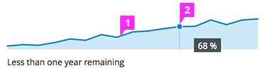

# Sparkline

  1. **Sparkline:** The sparkline is blue with a light blue fill, which helps to visually define the x axis.

  1. **Tooltip:** Use a tooltip on hover to display additional information about exact points on the sparkline such as values or percentages. A vertical line and dot may be added to accentuate the user’s hover point.
