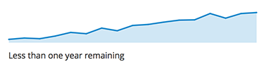

# Sparkline

A sparkline is a small chart that helps users to analyze data and understand trends and patterns (e.g. CPU Utilization in an environment). Sparklines are commonly used in tables, reports, and dashboards.

