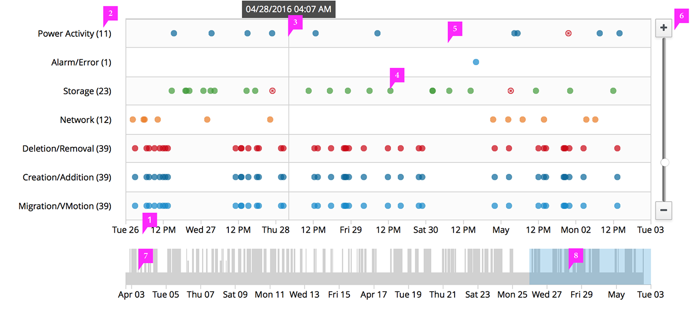
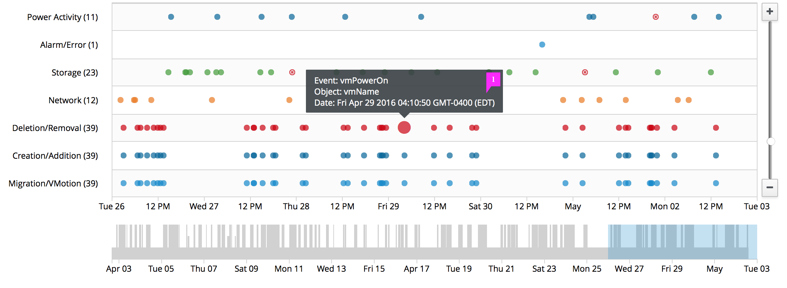

# Timeline

## Timeline

1. **Horizontal Axis Labels**: The horizontal axis labels display time
1. **Vertical Axis Labels**: The vertical axes labels represent the event type being displayed in that row.  The label can optionally include the total number of event indicators in the specified timeline.
1. **Hover Indicator**: When hovering over the timeline, a gray vertical line is displayed with a tooltip indicating the date and time of that point on the timeline.
1. **Events**
  * **Interaction** (optional):
    * If supported, clicking on an event indicator will display details of the event.  
    * If supported, right clicking on an event indicator will bring up a contextual menu with associated actions.
  * **Event Indicators**: Events can be visually represented as shapes or icons.  A user can view information related to a specific event by hovering over it.  To help the user see which point they are hovering, the dot expands. Additionally, a tooltip should appear with the associated values for that specific event.
  * **Color**: For recommendations on colors, see the [color palette](https://www.patternfly.org/styles/color-palette/).
1. **Interactive Chart**
  * Click and drag the chart left or right to navigate backwards or forward in time.
  * Use the mouse wheel to zoom in and out of the time range.
  * Note: The view context in the navigation viewport automatically adjusts its size and position to match the data shown.
1. **Zoom Slider**
  * **+** : Incrementally zooms into the time range
  * **-** :  Incrementally zooms out of the time range
  * **Slider Control**: Drag the slider control to zoom in and out of the time range.
1. **Navigation Viewport**: The navigation viewport shows the available time range of the data to be viewed.
1. **View Context**
  * Drag it left / right to scroll through the data on the main chart.
  * Click and drag the left and right edges to increase / decrease the amount of data shown.
  * Click off of the view context in the viewport to show the full data set in the main chart.
  * Click and drag on the viewport to create a new view context.

## Timeline Hover

1. **Tooltip**: Tooltips should include the event type, name of the object as well as the date and time the event occurred.
