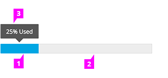
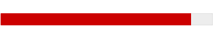

# Utilization Bar Chart

  1. **Used Value**
    - The used value bar shows the percentage (out of 100%) that has been consumed. The width and color of this bar can change according to the data.
    - **Chart Fill:**
      - The fill color can change to indicate that the data has surpassed a threshold. These include an orange warning and red error threshold, which can be used to indicate to a user that their consumption is nearing capacity.
      - When no thresholds are specified, the used value bar is blue.
      - When thresholds exist but have not been surpassed, the used value bar is green.

  1. **Total Value**
    -The total value bar is static in width and color. It represents the total available amount of a resource, and serves as a point of reference for the user as they study the chart.
      - The background color is grey (#d1d1d1).

  1. **Tooltip:** The chart does not effectively show precise values in its original state, so it is recommended that you display a tooltip on hover with the exact percentage value of the used value.

## **Warning Threshold**

This chart provides for a warning threshold that you may use when desired. 75% is the typical default value for activating a warning threshold, but you may configure this threshold to a custom value.
  - This threshold is orange (#ec7a08).

## **Error Threshold**

This chart provides for an error threshold that may be used when applicable. 90% is the typical default value for an error threshold, but you may configure this threshold to a custom value.
  - This threshold is red (#cc0000).
