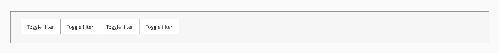
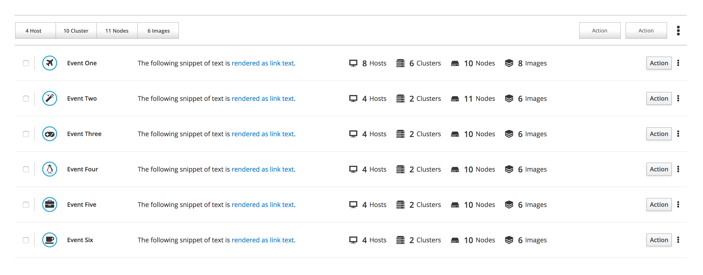
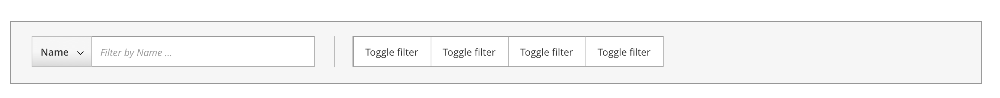
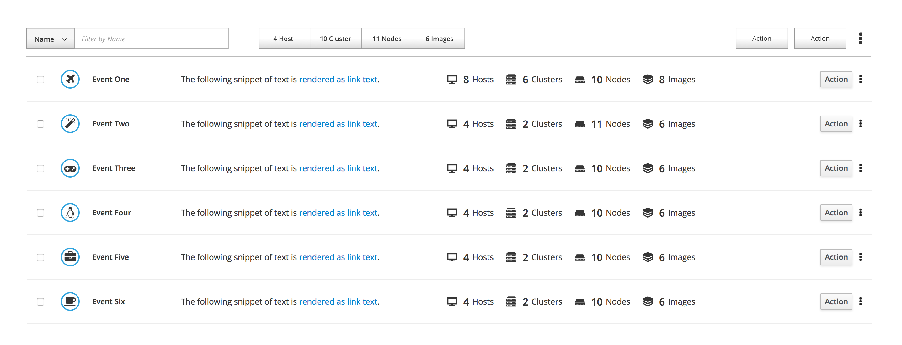
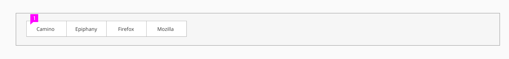
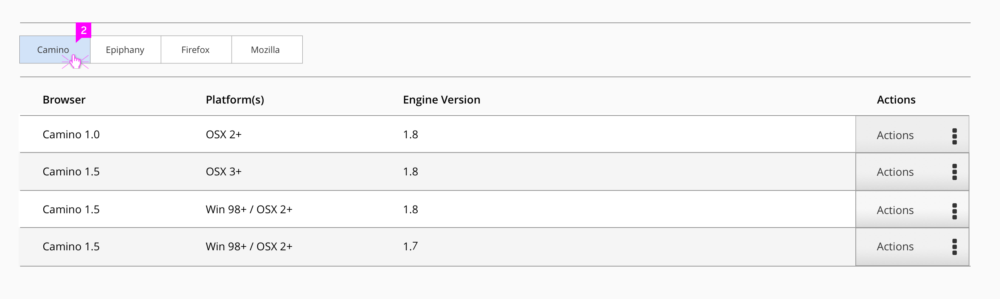
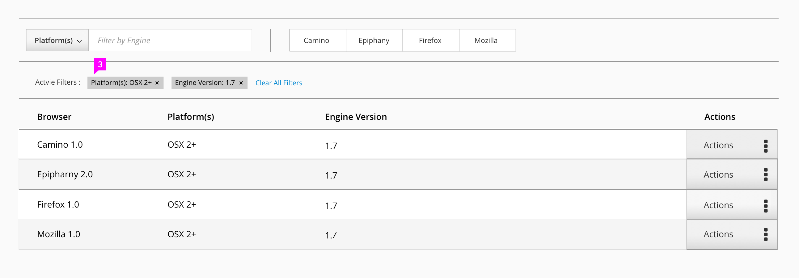
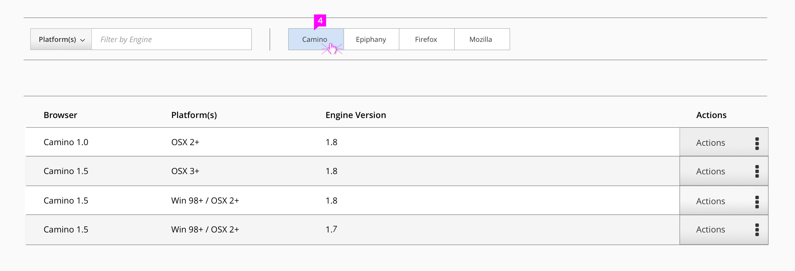
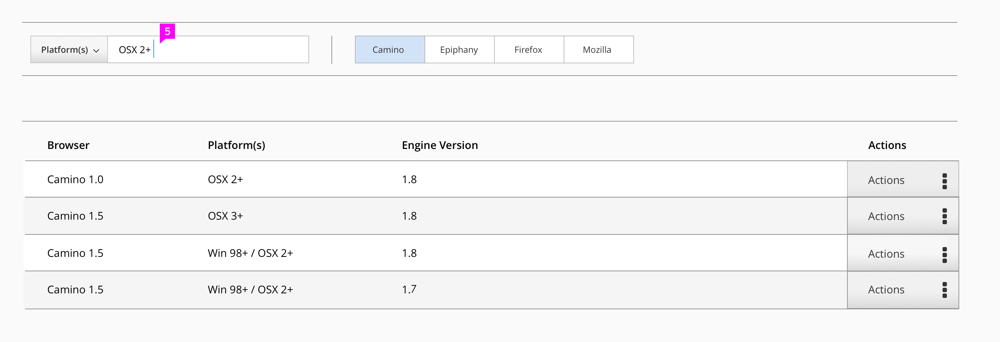
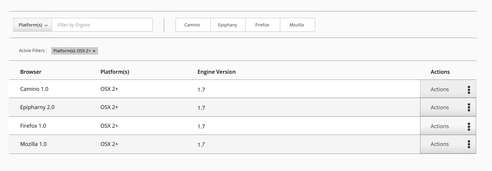

# Toggle Filter

## Design Description
Toggle filter is a component that enables a user to quickly access a common, singular filter criteria. It is displayed as a toggle button group. The application can use up to 4 quick filter criteria.

#### Toggle filter used with Filter
Toggle filter can be used with or without Filter, however, the filters cannot be active at the same time. When using together with Filter, the results of the two filters are separate. Toggle filter results are not dependent on the Filter. When a user clicks the toggle filter, after getting a result from the Filter, the previous filtering criteria (pill) and criteria results will be cleared, and replaced by the new results, based on the toggle filter criteria.

## Design Interaction

1.**Toggle filter attribute:** The attributes are single select buttons. The toggle filters are not representative of multiple filtering criteria per button. Each toggle button is an “or” command. Only one button can be chosen at a time.

  
2.**Toggle filter Selected and results:** When user clicks an attribute, the attribute will be highlighted.  Clicking on the attribute again, will deselect  and remove the filter and the highlighting. The data will go back to default. The filtering results listed under the pattern, will directly reflect the state of the toggle filter. The widget style is using the style of the current Patternfly Button Group. See [Patternfly button group](http://www.patternfly.org/pattern-library/widgets/).

3.**Toggle filter used with Filter,  toggle filter not in use:** When using together with Filter, The filtering results are independent. The widget style will be the same as the current Filter UI. [Filter pattern can be found here](http://www.patternfly.org/pattern-library/forms-and-controls/filter/#/overview).

4.**Toggle filter used with Filter, toggle filter in use:** When a user clicks the toggle filter after Filter activated, the previous filtering result will be clear and replaced by the new result.

5.**Toggle filter used before Filter:** In the case that user uses the Filter after having a result from the toggle filter, the result will be replaced by the Filter when the Filter is activated.
