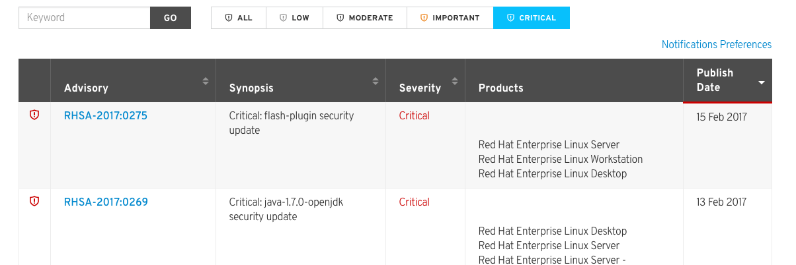
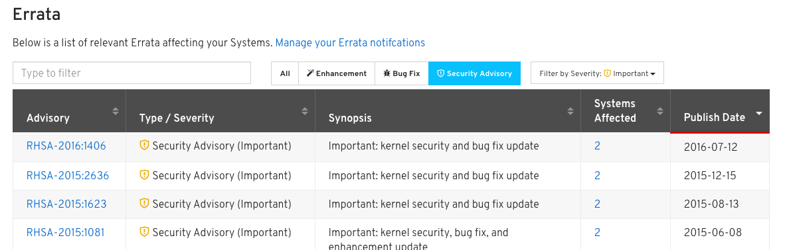

# Toggle Filter

#### Problem Solving

Toggle filter addresses the problem of a user frequently accessing filters, repeatedly, and having to select them over and over again. It will allow a user to quickly toggle, an individual filter criteria on and off, and immediately see the results, without having to relocate the filter criteria, via the drop down. It also addresses users knowing or discovering the existing filters and learning what data will be returned when selecting a filter.

#### Use Case(s)
User of an application, repeatedly uses, common filtering criteria, and wants to be able to frequently vary the return results of the criteria, without having to open and close a filter and relocate the same filters over and over again.

#### Requirements
The requirements stemming from the product that some users comp up with the requirement and send email to the pf-request@redhat.com.
- Toggle filter should be used independently of other filter patterns.
- An application will pre-define the toggle filters.
- Toggle filtering will not offer the ability for an end user to define which individual filters are used.
- There is a finite number of toggle filters.

#### Products already using this UI

