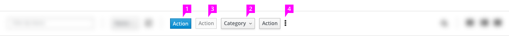
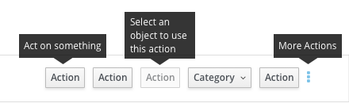
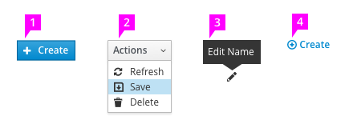
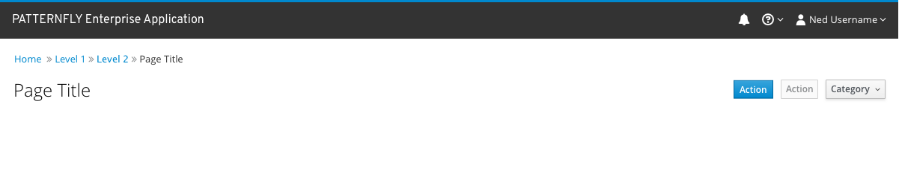

# Actions

## Actions in a toolbar

1. **Action buttons:** These buttons contain the most frequently used and most important actions or categories of actions for the current view. Buttons are arranged with the most common or important actions on the left. When space allows, at least one button featuring the most important action for the page should be visible at all times.
1. **Action category dropdown:** Actions that are related to one another may be grouped together into dropdowns. The dropdown should have a short name that describes the category of actions inside.
    - Action category dropdowns should never be disabled and should always be openable. A user should always be able to see which actions are inside of a category regardless of whether any or all of those actions are disabled at the time.
1. **Disabled action:** An action that is unavailable should be shown as disabled and should continue to be displayed on the toolbar or in a dropdown. If possible, a disabled action should have a tooltip that explains why the action is unavailable.
1. **More actions:** Less commonly used actions should be placed within this menu. In smaller windows, action buttons can be moved into the more actions menu in order to conserve space. Button groups should be moved into the more actions menu as a set rather than individually. If no action buttons remain, the more actions icon should be replaced by a dropdown.

## Tooltips on Actions

Tooltips serve several roles in the Actions pattern
  - Tooltips on action buttons should clarify what the action does when it is performed on an object.
  - Tooltips on disabled actions should describe why an action is disabled, or what needs to be done before the action becomes available (e.g. if the user has insufficient permissions to perform the action).
  - A tooltip on the "more actions" menu should label it as such.

## Icons on Action Buttons

Icons on action buttons are generally not recommended, but they can be useful in some circumstances. If icons are used with actions, the following rules should be followed.

1. Icons should be placed to the left of the action label and should be the same color as the label text.
1. Icon use should be consistent throughout the action set.
1. Icons without labels should only be used if the icon is extremely recognizable and has tooltip with a description of the action. The active area for action icons should be at least as wide as they are tall.
1. If an action needs to be strongly de-emphasized because it is inline with text or for another reason, it can be displayed without a border similarly to a link. In these cases, having an associated icon can be useful to differentiate the action from a regular link. All of the above guidelines should be followed in this case.

## Page-scoped actions

Pages that don't have a toolbar, such as object detail pages, should have their actions aligned with the page title, or in the upper right-hand corner of the page if a title does not exist.
These actions should otherwise behave and be styled like actions that are found in a toolbar.
