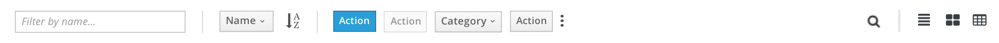
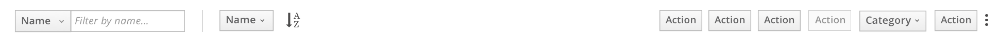
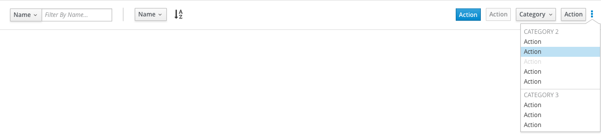
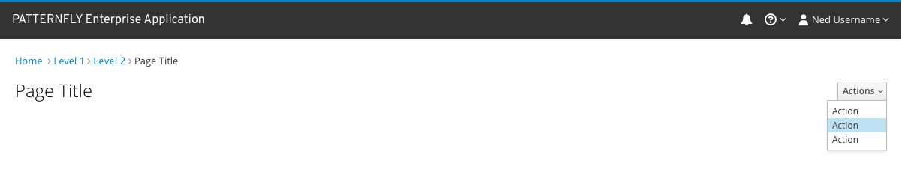

# Actions

Actions is a pattern that contains actions that operate on the objects in the current content view ([card view](http://www.patternfly.org/pattern-library/content-views/card-view/), [list view](http://www.patternfly.org/pattern-library/content-views/list-view/) or [table view](http://www.patternfly.org/pattern-library/content-views/table-view/)) or on the current page. These actions can apply to all of the objects in the view or a subset of them. The Actions pattern is often displayed as part of the [toolbar](http://www.patternfly.org/pattern-library/forms-and-controls/toolbar/), but can also appear at the tops of pages without a toolbar. Actions in Patternfly are represented as buttons to differentiate them from links, which navigate the user to a different location rather than acting on an item in view.

## In a toolbar

## In a toolbar without a view switcher

## With the more actions menu open

## On a page without a toolbar

