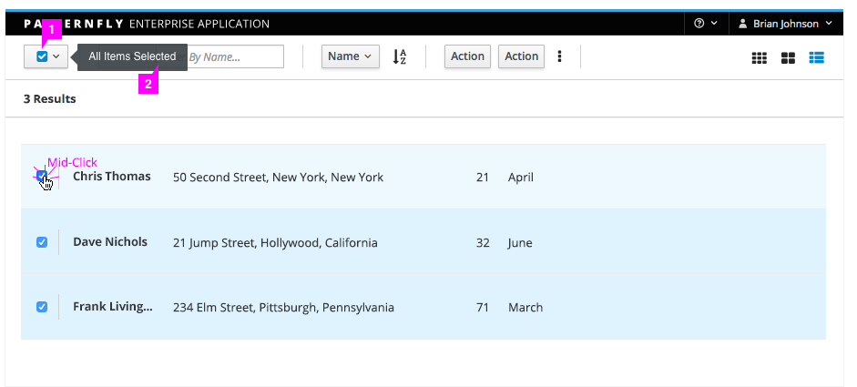
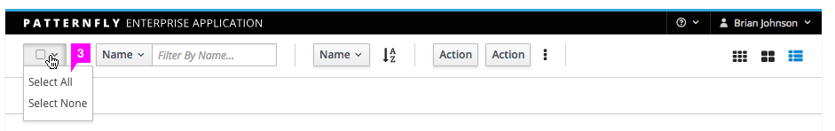
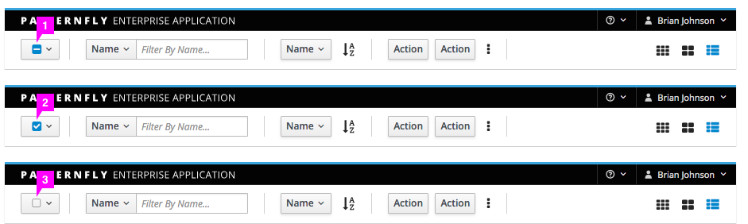
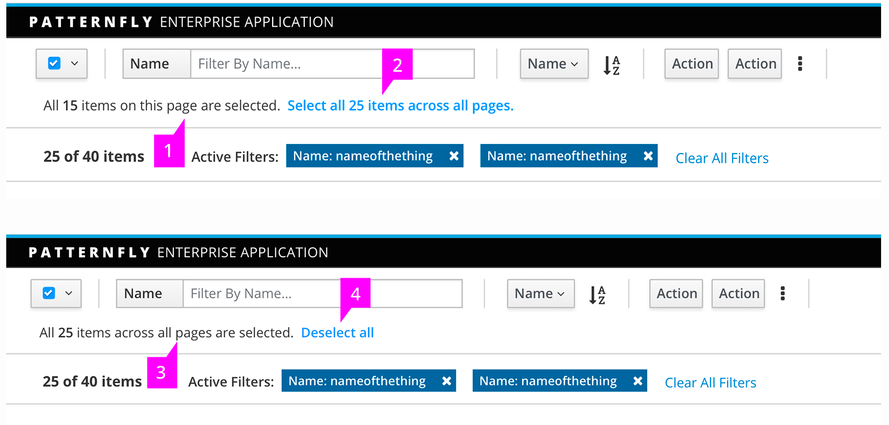
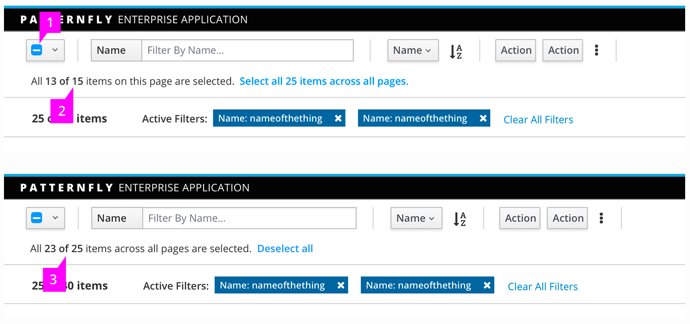

# Bulk Selector

1. **Bulk Selector Checkbox**: Enables a user to quickly select or deselect all elements on the current page of the related component.
 * Clicking the bulk selector when **some** items in the related component are selected will select all items.
 * Clicking the bulk selector when **all** items in the related component are selected will deselect all items.
 * Clicking the bulk selector when **no** items in the related component are selected will select all items.
2. **Tooltip** (optional): Reflects the current selection state.
 * For partially selected lists, the tooltip text is “Partially Selected” and screenreader text is “Click to select all”.
 * For lists with all selected, the tooltip text is “All Items Selected” and screenreader text is “Click to deselect all”.
 * For lists with none selected, the tooltip text is “No Items Selected” and screenreader text is “Click to select all”.
3. **Dropdown** (optional): Allows the user to select all items of a particular state. Default values are "Select All" and "Select None." The "Select None" option is disabled when the user already has none selected, and the "Select All" option is disabled when the user already has all selected. Additional values should be able to be added to work off of filtered states, such as "Red Cars or Blue Cars" / "Running VMs", etc. The dropdown component is recommended for use with a [card view](http://www.patternfly.org/pattern-library/content-views/card-view/).

## Partial Selection
Partial selection is an optional component of the bulk selector pattern. If the implementation can support it, the bulk selector should change to a partially selected state when some items are selected. Clicking the bulk selector in a partially selected state will deselect all items. In this case, the tooltip text is "Partially Selected" and the screenreader text will be "Click to deselect all".

With the partial selection component, the bulk selector checkbox fill can reflect three selection states:

 1. Partially Selected
 2. All Items Selected
 3. No Items Selected

 

This component is often used to select multiple items and perform an action on them. Note that after an action is completed, the selection state remains as is until the user changes the selection.

## “Select all” States
When clicking the bulk selector, an additional indication row will appear down below the toolbar to ask if the user wants to select all items in current page or all pages. When the bulk selector is unchecked, the indication row will disappear itself.

 1. The selection state on current page
 2. To select all items across all pages
 3. The number of items across all pages that are selected
 4. Deselect all to clear the selection across pages

 

## Mixed States
When the user has selected all items on the current page or across all pages and then unchecks one or more items, the message will be updated as shown.

1. The checkbox changes to the intermediate state
2. Checked item number of total item number on this page
3. Checked item number of total item number across all pages

See [list view](http://www.patternfly.org/pattern-library/content-views/list-view/) for more on list behavior and visual treatment.
