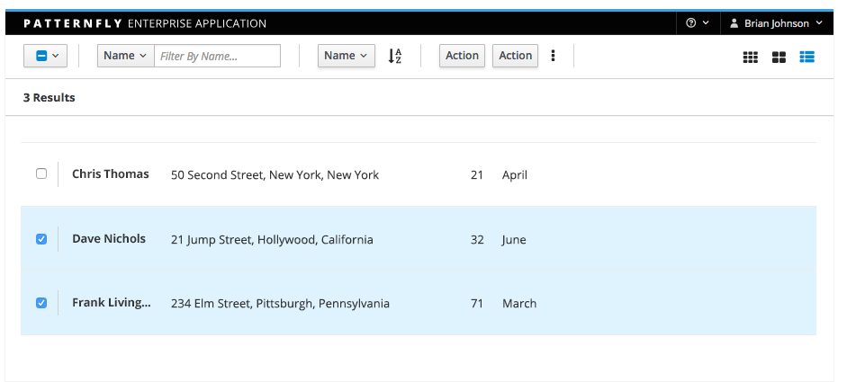
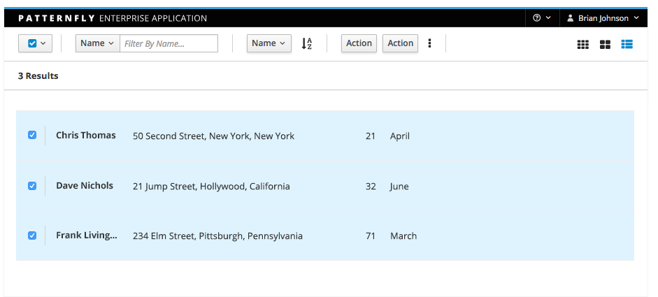
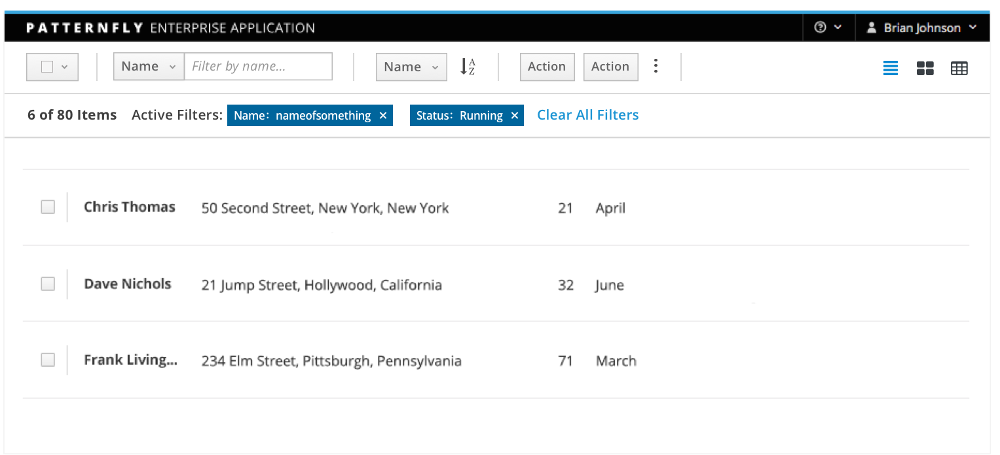

# Bulk Selector

The Bulk Selector enables users to quickly select or deselect all elements in a content view. The bulk selector is often displayed as a component of the [toolbar](http://www.patternfly.org/pattern-library/forms-and-controls/toolbar/). When the bulk selector pattern is shown, its state reflects the selection status of the related component (partially selected, all items selected, or no items selected).

There are two ways to interact with the bulk selector: clicking the checkbox icon or selecting an item on the dropdown.

The bulk selector should be used when multi-select behavior is supported in a [list view](http://www.patternfly.org/pattern-library/content-views/list-view/) or [card view](http://www.patternfly.org/pattern-library/content-views/card-view/). The optional dropdown component is recommended for clarity when used in card view.

This pattern should NOT be used:
* When information is displayed in a [table view](http://www.patternfly.org/pattern-library/content-views/table-view/). The table view component includes a bulk selector in its toolbar.

## Partially Selected

## All Items Selected

## No Items Selected

