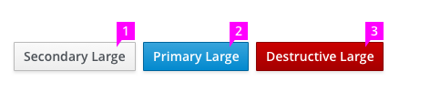

# Buttons on Forms

## Styling

  * Button language should be clear without the use of an icon. This will support accessibility and remove a dependency on creating an icon for every button.
  * Buttons should be of equal height. Varying button height can be distracting to the user and give inadvertent importance of one button over another. Do not combine differing sizes within the same row.
  * Three sizes of buttons are offered.
    1. Default.
    1. Large.
    1. Extra Small.

## Color

  * There are four different button colors with specific meanings:
    1. **Primary Button:** The primary button is blue, and should be used for the primary call to action on a page/modal. If present, there should only be one primary button (as each page should only have a single, clear call to action), and it should be triggered when the user hits the ENTER key.
    1. **Secondary Button:** Secondary buttons are gray. These will be the majority of the buttons used in an application. Any button that exists on a page that isn't a primary call to action should use this color.
    1. **Destructive Button:** The destructive button is red. This color should be reserved for highly destructive actions only. Most simple "Delete" or "Cancel" functions are not highly destructive. Evaluation should be done to agree that a button meets the highly destructive criteria. One example of a highly destructive action would be allowing the user to delete all hosts that a system is dependent on to run.

## State

  * There are a few state changes that each of the buttons could take on:
    1. **Active State:** Buttons will appear pressed when active.
    1. **Disabled State:** Buttons that could become enabled, but are currently not available will be disabled.
