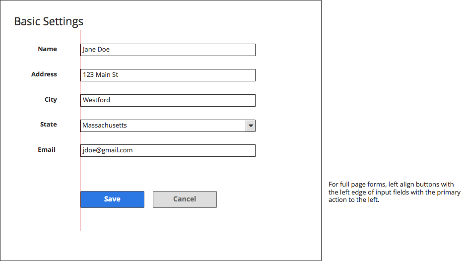
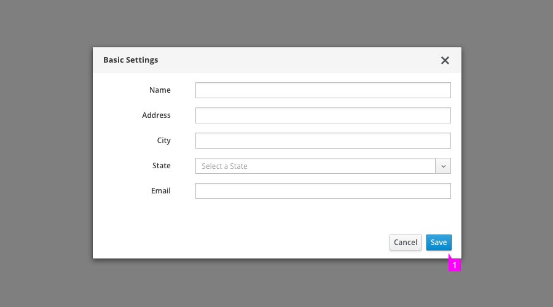
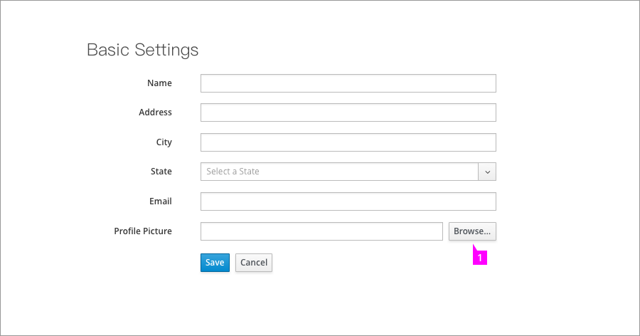

## Buttons on Forms

### High-Level Recommendations

* Align submit buttons to the left (Save, Cancel) on full page forms and to the right (Cancel, Save) on modals.

* Buttons within forms should be placed immediately to the right of or below the item that they affect.

* Disable submit buttons until all required form inputs have been satisfied.

Buttons are the primary means for invoking actions within forms.  They may be placed at the bottom of a form, as in the case of submit buttons or inline with other form content. 

#### Submit Buttons
Submit buttons are placed at the bottom of the page to optimize top to bottom flow.  There should always be two buttons, a primary action button that will commit changes made by the user and a Cancel button that will abort those changes.  By default, the primary action will be labeled Save unless there is use case specific naming that makes more sense.  The Cancel button should always discard any changes and return the user to their prior state before opening this form (i.e., close the modal window or navigation back to the parent page.)  See the [PatternFly Terminology and Wording Guidelines](http://www.patternfly.org/styles/terminology-and-wording/#_) for more guidance on button labeling.

#### Full Page Forms
For full page forms, submit buttons should be left aligned at the bottom of the page. Left align buttons with the left edge of the input fields with the primary action on the left.  

1. Submit buttons are left aligned with input fields on a full page form.

#### Modal Forms
On modal forms, the button are right aligned with the primary action as the right most button.

1. Primary submit button aligned with the right edge of input fields on a modal form.

#### Inline Actions
Buttons may also be used for inline actions within a form.  In these cases, the button should be placed to the right of or below the item that they affect.

1. Inline action button placed to the right of the field that it affects.

#### Enabling and Disabling Actions
Submit buttons should be disabled when all conditions required for completing a form are not met.  This will reduce the need to return validation errors because the user neglected to complete the form.  When using disabled buttons, it should always be possible for the user to enable the button by inputing information onto the current page.  Do not use this technique for blocking functionality that is not available to the current user or requires changes outside of the current page.

#### Styling Commonly Used Buttons

  **Close Button:**
Use "Close" to exit the current view.  Close should not be used when the view is editable as its meaning may not be clear.  In these cases Save and Cancel are recommended.  Style Close as a secondary button.

  **Delete Button:**
  "Delete" should be a secondary button unless you have a use case where the Delete action is a highly destructive action. In that case, use the destructive button style. Ideally, a delete button would be followed up with a confirmation modal for the user to confirm this action.

  **Cancel Button:**
  "Cancel" should be styled as a secondary button unless you have a limited use case where the Cancel action is a highly destructive action. In that case, use the destructive button.
  
  **Save Button:**
  "Save" should be styled as the primary button on all editable forms. 
