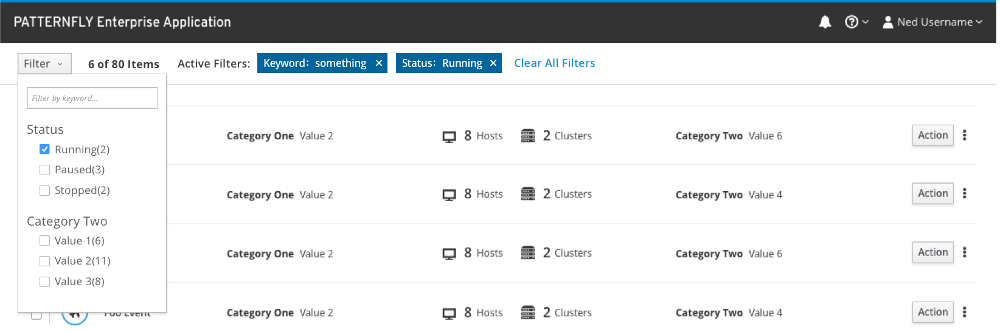
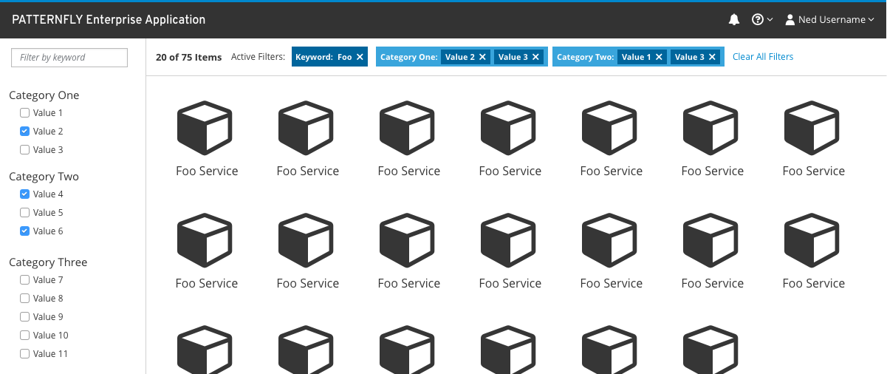

# Checkbox Filter

A checkbox filter is a [filter trigger](http://www.patternfly.org/pattern-library/forms-and-controls/filter/#/design) that enables users to add and remove filters primarily by checking and unchecking boxes next to filter criteria. A checkbox filter may also include a text field if filtering by a text string such as name or keyword is important.
Use a checkbox filter when...
- The user is browsing a set of items without robust knowledge of what is in the set.
- The important characteristics of the items to be filtered are mostly traits with a small and discrete set of choices like color, status, availability, or distributer rather than arbitrary text or numeric values such as name, date created, or amount of available space.
- If the important characteristics of the items are mostly open-ended values, consider using a [textbox filter](http://www.patternfly.org/pattern-library/forms-and-controls/textbox-filter/) instead.

Checkbox filters can be presented either as a dropdown in the toolbar or as a dedicated column on a content view.

Checkbox filter in a dropdown

A checkbox filter in a sidebar

