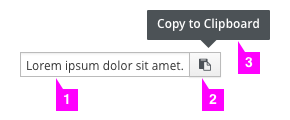
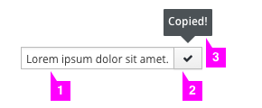
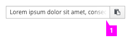
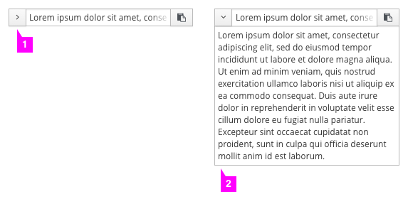

# Copy to Clipboard

Patterns Available:
* [Basic](#basic)
* [Long String Inline](#long-string-inline)
* [Long String Block](#long-string-block)

## Basic

### Initial State

1. **Copy content**: The content that is to be copied is distinguished from the adjacent text by a text box.
2. **Icon**: The clipboard icon (fa-clipboard) should be used to indicate that clicking the button will copy the encompassed text to the user's clipboard.
3. **Tooltip**: On hover, the tooltip reads "Copy to Clipboard." Screenreader text will also read "Copy to Clipboard."

### Copied State

1. **Copy content**: The copy content does not change after being copied.
2. **Icon**: A checkmark icon (fa-check) should be used to indicate that the encompassed text has been copied to the user's clipboard. This icon should remain for 2-3 seconds before returning to the copy icon.
3. **Tooltip**: After the copy icon has been clicked, the tooltip reads "Copied!" This tooltip should remain for 2-3 seconds before returning to the "Copy to Clipboard" text. Screenreader text will read back to the user the content they have copied. (Eg. "Copied 'Lorem ipsum dolor sit amet.'")

## Long String Inline

If the content to be copied is longer than the desired text box length and is being used inline, users can scroll within the text box to view the entire string. If the content is very long, the [block format](#long-string-block) is recommended.

1. **Text Fade**: Text will fade out to the right to indicate that more text is available for viewing.

## Long String Block

If the content to be copied is longer than the desired text box length and is being used as a block, users can expand the text box to view the entire string.

1. **Caret**: A caret will indicate that more text is available for viewing and allows users to hide and view the full text to be copied.
2. **Expanded View**: Users can view the entire string to be copied in the expanded view of the component.
