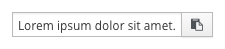
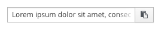

# Copy to Clipboard

## Overview

The copy to clipboard component allows users to quickly and easily copy content to their clipboard.

The content to be copied should be displayed in a text box with the copy icon on the right. Users may copy content to their clipboard by clicking the clipboard icon. This pattern can be used inline or as a separate block. Copy content may vary but is usually a string of characters.

## Basic Example

## Long String Inline Example

## Long String Block Example

