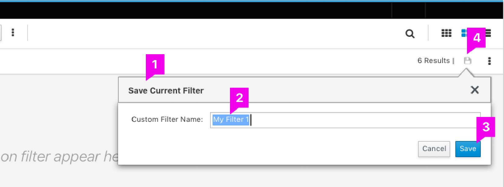

This template should provide high level information on the design, to inform the user, at a glance, if this pattern is a fit for their needs.

# Custom Filter

## Overview  

Custom Filter helps the user in saving any applied filter criteria with a name so that at a later point of time he can access the same from a list of saved such filter criteria and apply for desired the result set.

## Use Cases

This pattern can be used where the PatternFly Filter is used to filter a data set on the view. The user while applies different filter criteria in a view, the same can be saved with a name for later usage.

### Saving a Custom Filter

### Accessing a Custom Filter
 
