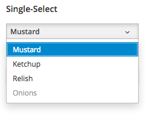
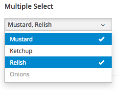

## Data Input

> Use radio button or checkboxes when you need to select from a small number of known options (2-5 options).  They provide users with the best visibility to choices.

> Select lists can be used when you have many options, are space-constrained, or  have variable options.

> On/off switches are a good alternative for enabling and disabling capabilities, but they should be used sparingly to reduce visual clutter.

> Use bound entry controls like datapickers, timepickers, or numeric touchspin  controls when entering strictly typed data.  This will reduce the need for field-level validation and prevent user input errors.

Forms enable users to input a variety of data.  Users may need to select from a fixed set of options or input a value directly.  Guidelines for selection from multiple options and entering values from the keyboard are included below.

### Selection Controls

#### Using Checkboxes, Radio Buttons, and Switches
Checkboxes, radio buttons, and switches are useful when you want to select from a list of optional settings.  Checkboxes should be used when allowing users to select one or more items from a list of options.  Radio buttons allow mutually exclusive selection.  As a general rule, radio buttons should not be used when more than 2-5 options are available or if you are space constrained.  In these cases a Select list is a better choice.

On/Off switches are a third option and can potentially take the place of a single checkbox or a set of two radio buttons.  Switches should only be used when the result will be to enable or disable some optional capability.  They may simplify labeling by allowing you to simply label the on/off switch with the name of the attribute being affected.  For general option selection, checkboxes should be the default choice.

#### Select Lists
Select lists provide an alternate method for selecting between multiple options when space is constrained or there are too many options to comfortable display on the page at once.  Select list should also be used when the options may vary.

PatternFly offers two types of Select controls, Bootstrap Single-Select for selecting between mutually exclusive options and Bootstrap Multi-Select for selecting one or more options from a list.  When a small number of options exist, radio buttons or checkboxes are preferred over select lists as they serve to make all the options visible.

### Data Entry Controls

#### Text Entry
Text edit fields are the simplest and most common controls for allowing a user to enter a string of characters from the keyboard.  Edit fields should be appropriately sized to anticipate the longest value possible (if a maximum character length is known).  In cases where a value is too long to be fully displayed in an edit box, [truncation](http://www.patternfly.org/styles/terminology-and-wording/#_) should be used.

If the acceptable entries into a text edit field are constrained, syntax hints and field validation are recommended to prevent data entry errors.

#### Bound Entry Controls
Bound entry controls should be used when entering special data types, including dates, time, and other forms of numeric data.  These controls constrain user input and combine keyboard and mouse interaction.  They are designed to only allow valid inputs and therefore avoid the need for secondary validation.  See the DatePicker, TimePicker, and Bootstrap Touchspin components for more details.

